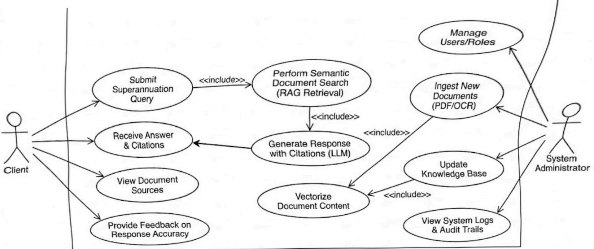
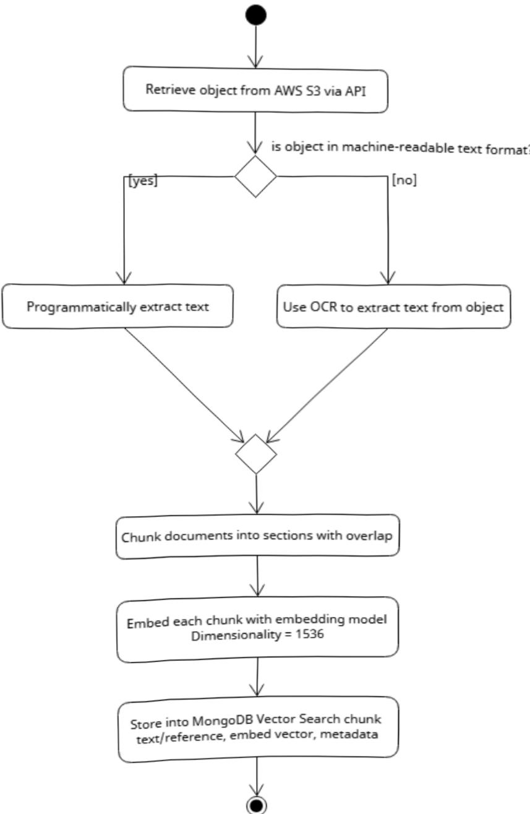
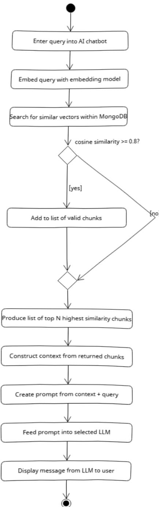
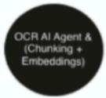

# Project 26: RAG-based Chatbot for  Advisors 

Mark Shim 

Shehara Hewawasam Yiyou (Fred) Xu Weihom Tan Jun Ng 

Page: 0

## Table of Contents 

1.0 Introduction..3  
2.0 System Use Case Diagram..4  
Fig 2.0.1 System Use Case Diagram.4  
3.0 What is Rag? Why is it useful here?. 5  
How It Works..5  
Why RAG is Useful..5  
1. Eliminating "Hallucinations".5  
2. Access to Private or "Fresh" Data..5  
3. Cost-Effectiveness...5  
4. Transparency and Citations..5  
5. Easy Data Management..6  
Developer Frameworks (For building custom solutions)..6  
Managed & "No-Code" Platforms (For fast deployment)..6  
4.0 Proposed Project Pipeline..7  
Fig 4.2.1 Storing document into vector database..7  
Fig 4.2.2 Retrieving from vector database and prompting LLM .8  
4.1 Proposed Pipeline Methods..9  
Processing of Documents.. 9  
Retrieval of Documents..9  
How the Al Receives the Documents..9  
5.0 OCR options... 10  
6.0 Indexing Strategies..11  
7.0 Query Optimization Strategies..13  
8.0 Output Generation Optimization Strategies .15  
9.0 Considered LLM Models...16  
10.0 Developer Frameworks...17  
11.0 Integration Strategy.... 18  
12.0 Sample User Stories. 19  
5.0 Rationale.. 20  
2.1 RAG Alternatives..21  
13.0 Conclusion...22

Page: 1 ### 1. 0 Introduction 

This document illustrates the research and considerations that our team has conducted.regarding the proposed project of producing a RAG-based chatbot for Triple A SuperPty Ltd.The introduction aims to provide a short outline of the contents within the document.

The document starts off by showing a system use case diagram which represents the team's view on what the final product should deliver. Following this is a section containing research. on RAG, its benefits, along with an overview of available frameworks. A proposed project  pipeline is then shown in the form of an action diagram as well as some proposed pipeline methods.

The next few sections delve deeper into possible solutions and strategies for each specific part of the pipeline, namely: OCR; indexing; query optimisation; output generation optimisation; LLM models; and developer frameworks. Each section explores multiple options, explains what these options are and describes the benefits and drawbacks of each..In integration strategies, a solution for how these different parts of the pipelines are integrated is presented to the client. Some sample user stories further reinforce the final.product and allow for the team and client to align views regarding the product vision..

Page: 2

### 2. 0 System Use Case Diagram 

Fig 2.0.1 System Use Case Diagram 

{"blocks": ["Client", "Submit Superannuation Query", " <<include>> ", "Perform Semantic Document Search (RAG Retrieval)", "Receive Answer & Citations", "View Document Sources", "Provide Feedback on Response Accuracy", "Generate Response with Citations (LLM)", " <<include>> ", "Vectorize Document Content", "Manage Users/Roles", "Ingest New Documents (PDF/OCR)", " <<include>> ", "Vectorize Document Content", "Update Knowledge Base", " <<include>> ", "Vectorize Document Content", "View System Logs & Audit Trails"]}

Page: 3

### 3. 0 What is Rag? Why is it useful here?

RAG (Retrieval-Augmented Generation) is a technique used to give Large Language  Models (LLMs) access to specific, private, or up-to-date data without the need to retrain the model itself.

Think of an LLM as a brilliant student taking an exam. Without RAG, the student relies.entirely on their memory (their training data). With RAG, the student is allowed to use an.open textbook to look up specific facts before answering.

## How It Works

The RAG process follows three main steps:

1. Retrieval: When a user asks a question, the system searches a specific database or set of documents for information related to that query.

2. Augmentation: The system takes the relevant snippets found during the search and adds them to the user's original prompt as "context."

3. Generation: The LLM reads both the question and the provided context to generate.a precise, grounded answer..

## Why RAG is Useful

### 1. Eliminating "Hallucinations"

LLMs are designed to predict the next word, which sometimes leads them to confidently state facts that are incorrect. By forcing the model to cite specific "source" text provided in the prompt, RAG significantly reduces the chances of the Al making things up..

### 2. Access to Private or "Fresh" Data 

Standard LLMs have a "knowledge cutoff" (the date their training ended). They don't know what happened yesterday, and they don't know what is inside your private company files.

. Use Case: An Al can answer questions about a company's 2026 internal travel policy or a project proposal written this morning by "retrieving" those specific documents.

### 3. Cost-Effectiveness 

Training or "fine-tuning" a custom Al model is incredibly expensive, requiring massive computing power and specialized engineers. RAG allows you to achieve high-performance,specialized results using a standard "off-the-shelf" model, which is much cheaper and faster to implement.

### 4. Transparency and Citations 

Because RAG pulls information from specific documents, the system can provide source citations. In an FAQ or legal context, this is vital because it allows the user to verify exactly 

Page: 4 where the information came from (e.g., "According to Section 4.2 of the Employee Handbook...").

### 5. Easy Data Management 

If a policy changes, you don't need to retrain the Al. You simply update the text file in your  database. The next time the RAG system performs a search, it will find the new document and provide the updated information immediately.

## Developer Frameworks (For building custom solutions)

If you have engineering resources and want full control over the pipeline, these are the industry standards:

Llamalndex: Widely considered the best orchestration framework for RAG. It excels at "data ingestion"-it has over 160 connectors to pull FAQs from PDFs, Notion,Slack, or SQL databases. It is highly optimized for document Q&A.

LangChain: The most popular framework for building LLM applications. It is very  modular, allowing you to swap out different vector databases (like Pinecone or Weaviate) and LLMs (like GPT-4 or Claude) easily.

Haystack: An open-source framework by Deepset specifically designed for building production-ready search and Q&A systems. It is often cited as being more streamlined for "search-centric" RAG than LangChain.

## Managed & "No-Code" Platforms (For fast deployment)

If you want to upload a document and have a functioning FAQ bot in minutes without managing infrastructure:

Wonderchat / Chatbase: These are "RAG-as-a-Service" platforms. You provide a URL or upload a PDF of your FAQs, and they provide an embeddable chat widget.They handle the embedding, storage, and retrieval layers internally.

Docsie: Specifically designed for documentation and internal knowledge bases. It  features "version awareness," which is useful if your FAQs change based on different product versions.

Danswer: An open-source enterprise search engine that you can self-host. It connects to your company's tools (Google Drive, Confluence, etc.) and provides a ChatGPT-like interface for asking questions across all those sources.

Similar existing software, with RAG functions:

Make.com 

 n8n.io 

These are automation softwares with additional features centered around Al automation 

Page: 5

### 4. 0 Proposed Project Pipeline 

Fig 4.2.1 Storing document into vector database 

{"blocks": ["Retrieve object from AWS S3 via API", "is object in machine-readable text format", "[yes]", "Programmatically extract text", "[no]", "Use OCR to extract text from object", "Chunk documents into sections with overlap", "Embed each chunk with embedding model Dimensionality = 1536", "Store into MongoDB Vector Search chunk text/reference, embed vector, metadata"]}

Page: 6

Fig 4.2.2 Retrieving from vector database and prompting LLM 

{"blocks": ["Enter query into AI chatbot", "Embed query with embedding model", "Search for similar vectors within MongoDB", "cosine similarity >= 0.8?", "[yes]", "Add to list of valid chunks", "[no]", "", "Produce list of top N highest similarity chunks", "Construct context from returned chunks", "Create prompt from context + query", "Feed prompt into selected LLM", "Display message from LLM to user"]}

Page: 7

### 4.1 Proposed Pipeline Methods 

## Processing of Documents 

Source Ingestion: Documents are ingested directly from the client's existing S3buckets, maintaining the current mapping to MongoDB..

OCR Integration: To process the "picture-based PDFs" identified in the source data,the pipeline will utilize the client's existing OCR pipeline for high-fidelity text extraction.

Robust Metadata Extraction: Since the source data has "no specific naming scheme," the processing stage will include an automated classification step. The system will extract key metadata--such as Fund Name, Effective Date, and Document Type--and store these alongside the vector embeddings to provide structure to the current "chaos".

Chunking & Embedding: The extracted text is cleaned, split into semantically meaningful chunks, and converted into numerical embeddings for storage in MongoDB Atlas Vector Search.

## Retrieval of Documents

Hybrid Search Strategy: Rather than relying solely on semantic similarity, the system utilizes Hybrid Search, which merges vector search with keyword matching. This  ensures the chatbot handles both natural language queries and exact fund-specific terminology with high accuracy..

Metadata Filtering: The system will use the extracted metadata (e.g., Fund Name) to filter the search space, ensuring that the Al only retrieves relevant rules for the specific fund being queried, further reducing the risk of hallucinations..

## How the Al Receives the Documents

Context Augmentation: When a user submits a query, the system retrieves the top-ranked document chunks and appends them to the LLM prompt as grounded context.

Verifiable Citations: The Al generates responses solely based on these retrieved chunks. Crucially, the response will include direct citations and source links back to  the original PDFs in the S3 bucket, allowing advisors to verify the information.instantly 

Page: 8

5.0 OCR options 

<html><body><table border="1"><tr><td>Types</td><td>Description</td><td>Advantages</td><td>Disadvantages</td></tr><tr><td>Tesseract OCR</td><td>An open source OCR engine developed by Google that converts images or scanned documents into machine readable text</td><td>- Free and open source - Can run locally - Customisable</td><td>- Lower accuracy compared to enterprise tools - Struggle with tables and forms - Requires manual tuning and setup</td></tr><tr><td>Amazon Textract</td><td>A cloud-based OCR service by Aws that can extract text and structured information such as tables and forms</td><td>- Higher accuracy - Able to extract tables and forms - Scalable and fully. managed</td><td>- Paid service - Potential data privacy risks - Dependant on Aws. infrastructure</td></tr><tr><td>Google Document Al</td><td>An advanced document understanding platform that combines OCR with AI models to extract structured and contextual information</td><td>- Very high accuracy. - Able to extract tables and forms - Able to extract contextual relationships</td><td>- Paid service - Requires Google Cloud setup - More complex to configure - Potential data privacy risks</td></tr></table></body></html>

{"blocks": ["| Types | Description | Advantages | Disadvantages |\n|---|---|---|---|\n| Tesseract OCR | An open source OCR engine developed by Google that converts images or scanned documents into machine readable text | - Free and open source\n- Can run locally\n- Customisable | - Lower accuracy compared to enterprise tools\n- Struggle with tables and forms\n- Requires manual tuning and setup |\n| Amazon Textextract | A cloud-based OCR service by AWS that can extract text and structured information such as tables and forms | - Higher accuracy\n- Able to extract tables and forms\n- Scalable and fully managed | - Paid service\n- Potential data privacy risks\n- Dependant on AWS infrastructure |\n| Google Document AI | An advanced document understanding platform that combines OCR with AI models to extract structured and contextual information | - Very high accuracy\n- Able to extract tables and forms\n- Able to extract contextual relationships | - Paid service\n- Requires Google Cloud setup\n- More complex to configure\n- Potential data privacy risks |"]}

Page: 9

### 6. 0 Indexing Strategies 

 Indexing in RAG involves turning large amounts of data into vectors which are then input into. a multidimensional space. In this section we will explore the different strategies which were considered for use in the project..

<html><body><table border="1"><thead><tr><td>Strategy</td><td>Description</td><td> Advantages</td><td>Disadvantages</td></tr></thead><tbody><tr><td>Multi-Representation Indexing</td><td>This approach involves embedding multiple summaries of a document that acts as shortcuts to the real document that is the actual thing being returned by the system</td><td>Improves recall by allowing queries to match different summaries of the same document Faster retrieval as summaries are shorter Helps for queries that use different wording than the document</td><td>Requires additional - storage for multiple embeddings Summaries may lose important details Extra preprocessing time to generate summaries</td></tr><tr><td>Hierarchical Indexing</td><td>This approach involves creating multiple hierarchies of documents into various levels of detail,. with lower levels containing more detailed documents whereas higher levels contain summaries</td><td>Efficient retrieval by narrowing search from summary to detailed chunks Scales well for very - large document collections Can improve retrieval accuracy by filtering irrelevant sections early</td><td>More complex system design Requires maintaining multiple index layers Errors in higher-level - summaries can cause relevant documents to be missed</td></tr><tr><td>Time-Based Indexing</td><td>This approach involves embedding each piece of document with a date label, this way the Al knows which document is. the most recent and therefore the most relevant</td><td>Ensures recent and therefore more relevant information is prioritized Useful for domains with frequently changing data (such as our use case in case policies change)</td><td>Older documents may still contain useful information but get ignored Requires accurate - timestamp metadata Adds complexity to ranking logic</td></tr><tr><td>Domain Indexing</td><td>This approach involves labeling different chunks according to what domain of knowledge they contain</td><td>Improves retrieval accuracy for specialized queries Allows domain filtering before retrieval</td><td>Hard to set up Requires domain knowledge or manual labeling May fail if documents belong to multiple</td></tr></tbody></table></body></html>

{"blocks": ["| Strategy | Description | Advantages | Disadvantages |\n| --- | --- | --- | --- |\n| Multi-Representation Indexing | This approach involves embedding multiple summaries of a document that acts as shortcuts to the real document that is the actual thing being returned by the system | - Improves recall by allowing queries to match different summaries of the same document\n- Faster retrieval as summaries are shorter\n- Helps for queries that use different wording than the document | - Requires additional storage for multiple embeddings\n- Summaries may lose important details\n- Extra preprocessing time to generate summaries |\n| Hierarchical Indexing | This approach involves creating multiple hierarchies of documents into various levels of detail, with lower levels containing more detailed documents whereas higher levels contain summaries | - Efficient retrieval by narrowing search from summary to detailed chunks\n- Scales well for very large document collections\n- Can improve retrieval accuracy by filtering irrelevant sections early | - More complex system design\n- Requires maintaining multiple index layers\n- Errors in higher-level summaries can cause relevant documents to be missed |\n| Time-Based Indexing | This approach involves embedding each piece of document with a date label, this way the AI knows which document is the most recent and therefore the most relevant | - Ensures recent and therefore more relevant information is prioritized\n- Useful for domains with frequently changing data (such as our use case in case policies change) | - Older documents may still contain useful information but get ignored\n- Requires accurate timestamp metadata\n- Adds complexity to ranking logic |\n| Domain Indexing | This approach involves labeling different chunks according to what domain of knowledge they contain | - Improves retrieval accuracy for specialized queries\n- Allows domain filtering before retrieval | - Hard to set up\n- Requires domain knowledge or manual labeling\n- May fail if documents belong to multiple |"]}

Page: 10

<html><body><table border="1"><tr><td></td><td></td><td>Helps reduce irrelevant results. from unrelated topics</td><td> domains</td></tr><tr><td>CoIBERT</td><td>This approach involves embedding everything at the token level. Improving accuracy at the cost of massively increased computing complexity and storage costs.</td><td>Very high retrieval. - accuracy Very good at capturing semantic relationship Handles complex - queries well</td><td>Very high storage requirements Increased computation cost during retrieval</td></tr></table></body></html>

 Some combination of these strategies should be used for indexing as we would be able to combine their advantages while offsetting their disadvantages. What I would recommend is  some combination of multi-representation, time-based and hierarchical indexing.{"blocks": ["| | | - Helps reduce irrelevant results from unrelated topics | domains |\n| --- | --- | --- | --- |\n| ColBERT | This approach involves embedding everything at the token level. Improving accuracy at the cost of massively increased computing complexity and storage costs. | - Very high retrieval accuracy\n- Very good at capturing semantic relationship\n- Handles complex queries well | - Very high storage requirements\n- Increased computation cost during retrieval |"]}

Page: 11

### 7. 0 Query Optimization Strategies 

Query optimization strategies exist as a checkpoint between the actual user prompt and what is being sent to the LLM. These optimizations help the LLM return good answers as user prompts are often confusing or ambiguous to the LLM.

<html><body><table border="1"><thead><tr><td> Strategy</td><td>Description</td><td> Advantages</td><td>Disadvantages</td></tr></thead><tbody><tr><td> Multi-Query</td><td>This strategy involves splitting the prompt into multiple distinct queries that are each then used as. a separate vector.</td><td>Improves recall by retrieving documents that may match different phrasings of the same question. Reduces dependence on a single embedding interpretation.</td><td>Can retrieve many redundant or irrelevant documents. Increased compute and latency due to multiple searches</td></tr><tr><td>RAG fusion</td><td>Similar to multi-query, but also ranks the documents that are used so that more. relevant documents are ranked higher and therefore used to create the output.</td><td>Improves document - ranking quality. Reduces noise from multi-query retrieval. Documents retrieved by multiple queries get boosted, improving relevance.</td><td>Additional ranking step adds complexity Slightly higher compute cost. Still depends on the - quality of generated queries.</td></tr><tr><td>Query Decomposition</td><td>This strategy involves breaking questions into smaller sub-questions, the answer from the earlier sub questions can be used to improve or inform the. answers for the later sub. questions</td><td>Effective for multi-step reasoning questions. Improves retrieval accuracy for complex queries. Allows chaining of - knowledge across documents.</td><td>Slower due to - multiple retrieval cycles. Errors in early sub-questions can propagate into later answers.</td></tr><tr><td>Step-Back prompting</td><td>Uses a more abstract question to broaden the search radius to provide better context for the original problem. Eg: "Can the police arrest someone?" -> "What can the police do?"</td><td>- Helps retrieve higher-level conceptual knowledge. Useful when the original query is too specific or poorly phrased. Improves contextual grounding.</td><td>Abstract questions may retrieve overly general documents. Requires additional prompt generation step.</td></tr><tr><td>HyDE</td><td>Generates a hypothetical document that would contain the answer to the prompt; then searches around where that document would be embedded.</td><td>Produces richer - semantic queries than short prompts. Often improves retrieval when the user query is vague or lacks context.</td><td>If the generated hypothetical document is inaccurate, retrieval quality may decrease. Adds extra</td></tr></tbody></table></body></html>

{"blocks": ["| Strategy | Description | Advantages | Disadvantages |\n| --- | --- | --- | --- |\n| Multi-Query | This strategy involves splitting the prompt into multiple distinct queries that are each then used as a separate vector. | - Improves recall by retrieving documents that may match different phrasings of the same question.\n- Reduces dependence on a single embedding interpretation. | - Can retrieve many redundant or irrelevant documents.\n- Increased compute and latency due to multiple searches |\n| RAG fusion | Similar to multi-query, but also ranks the documents that are used so that more relevant documents are ranked higher and therefore used to create the output. | - Improves document ranking quality.\n- Reduces noise from multi-query retrieval.\n- Documents retrieved by multiple queries get boosted, improving relevance. | - Additional ranking step adds complexity\n- Slightly higher compute cost.\n- Still depends on the quality of generated queries. |\n| Query Decomposition | This strategy involves breaking questions into smaller sub-questions, the answer from the earlier sub questions can be used to improve or inform the answers for the later sub questions | - Effective for multi-step reasoning questions.\n- Improves retrieval accuracy for complex queries.\n- Allows chaining of knowledge across documents. | - Slower due to multiple retrieval cycles.\n- Errors in early sub-questions can propagate into later answers. |\n| Step-Back prompting | Uses a more abstract question to broaden the search radius to provide better context for the original problem. Eg: “Can the police arrest someone?” -> “What can the police do?” | - Helps retrieve higher-level conceptual knowledge. Useful when the original query is too specific or poorly phrased.\n- Improves contextual grounding. | - Abstract questions may retrieve overly general documents.\n- Requires additional prompt generation step. |\n| HyDE | Generates a hypothetical document that would contain the answer to the prompt; then searches around where that document would be embedded. | - Produces richer semantic queries than short prompts.\n- Often improves retrieval when the user query is vague or lacks context. | - If the generated hypothetical document is inaccurate, retrieval quality may decrease.\n- Adds extra |"]}

Page: 12

<html><body><table border="1"><tr><td></td><td></td><td>generation step before retrieval.</td><td></td></tr></table></body></html>

I recommend we go with some combination of these strategies. However, these strategies. may not be needed depending on how flexible the user prompts are allowed to be; as having. a set list of questions that the user is allowed to ask would allow us to fine tune each prompt to become good queries. Failing that, I would recommend some combination of RAG fusion,.Query decomposition if the user asks multi step questions, and Step-Back prompting. HyDE may generate false documents with inaccurate information, and must therefore be thoroughly tested if used.

{"blocks": ["|---|---|---|---|\n| | | | generation step before retrieval. |"]}

Page: 13

8.0 Output Generation Optimization Strategies 

<html><body><table border="1"><thead><tr><td>Strategy</td><td>Description</td><td>Advantages</td><td> Disadvantages</td></tr></thead><tbody><tr><td>Prompt Engineering</td><td>This approach involved designing structured, specific instructions for the LLM to guide how it generates responses.</td><td>- Reduce hallucinations by guiding the model to use only provided context - Improves consistency in responses - Easy to implement and adjust - Allows control over tone,. format and output structure.</td><td>- Poorly designed prompts can lead to incorrect outputs - May need frequent refinement for different query types</td></tr><tr><td>Context Filtering</td><td>This approach involved selecting only the most relevant document chunks to send to the LLM, instead of passing all retrieved data.</td><td>- Reduces irrelevant information - Improves response accuracy - Faster processing due to smaller input size</td><td>- Important information may be. excluded if filtering is too strict. - Requires tuning</td></tr><tr><td>Response Grounding</td><td>This approach involved ensuring that the LLM generates answers strictly based on the retrieved document content rather than relying on its own pre-trained knowledge.</td><td>- Improve accuracy and reliability - Ensures responses are based on trusted internal data - Reduces hallucination risk</td><td>- May limit the model's ability to. provide a broader response</td></tr><tr><td>Citation Generation</td><td>This approach involved including references to the source documents in the model's responses.</td><td>- Allows verification of information - Make the response trustable - Improves explainability and transparency</td><td>- Requires proper metadata and tracking - Adds complexity to response. formatting</td></tr><tr><td>Fallback Mechanism</td><td>This approach involved preventing the system from generating answers when the retrieved information is insufficient or has low relevance.</td><td>- Prevents incorrect or misleading answers - Improves system reliability - Safer for sensitive domains.</td><td>- May keep unable to give a response - Needs to set appropriate thresholds</td></tr></tbody></table></body></html>

{"blocks": ["| Strategy | Description | Advantages | Disadvantages |\n| --- | --- | --- | --- |\n| Prompt Engineering | This approach involved designing structured, specific instructions for the LLM to guide how it generates responses. | - Reduce hallucinations by guiding the model to use only provided context\n- Improves consistency in responses\n- Easy to implement and adjust\n- Allows control over tone, format and output structure | - Poorly designed prompts can lead to incorrect outputs\n- May need frequent refinement for different query types |\n| Context Filtering | This approach involved selecting only the most relevant document chunks to send to the LLM, instead of passing all retrieved data. | - Reduces irrelevant information\n- Improves response accuracy\n- Faster processing due to smaller input size | - Important information may be excluded if filtering is too strict\n- Requires tuning |\n| Response Grounding | This approach involved ensuring that the LLM generates answers strictly based on the retrieved document content rather than relying on its own pre-trained knowledge. | - Improve accuracy and reliability\n- Ensures responses are based on trusted internal data\n- Reduces hallucination risk | - May limit the model's ability to provide a broader response |\n| Citation Generation | This approach involved including references to the source documents in the model's responses. | - Allows verification of information\n- Make the response trustable\n- Improves explainability and transparency | - Requires proper metadata and tracking\n- Adds complexity to response formatting |\n| Fallback Mechanism | This approach involved preventing the system from generating answers when the retrieved information is insufficient or has low relevance. | - Prevents incorrect or misleading answers\n- Improves system reliability\n- Safer for sensitive domains | - May keep unable to give a response\n- Needs to set appropriate thresholds |"]}

Page: 14

### 9. 0 Considered LLM Models 

<html><body><table border="1"><tr><td>Models</td><td>Strengths</td><td>Weaknesses</td></tr><tr><td>Ollama(used to run LLM models)</td><td>- Runs locally so it has full data privacy - No API cost after setup - Works offline - Full control over models and deployment</td><td>- May have lower performance compared to large cloud-based models - Requires strong hardware: RAM or GPU - Less capable in handling highly complex. reasoning tasks compared to advanced cloud models</td></tr><tr><td>Gemini</td><td>- Strong multimodal capabilities, able to handle text and images - Works well with Google Cloud services - Good performance in reasoning and general tasks</td><td>- Privacy issues due to cloud-based processing. - Requires integration with Google Cloud services, which may increase setup complexity</td></tr><tr><td>OpenAI</td><td>- Very strong performance in reasoning, accuracy and reliability - Best for complex reasoning and built-in RAG tooling</td><td>- Continuous usage costs through API pricing - Data is processed externally, which may raise data privacy concerns - Requires internet connectivity for API access</td></tr></table></body></html>

{"blocks": ["| Models | Strengths | Weaknesses |\n| --- | --- | --- |\n| Ollama (used to run LLM models) | - Runs locally so it has full data privacy - No API cost after setup - Works offline - Full control over models and deployment | - May have lower performance compared to large cloud-based models - Requires strong hardware: RAM or GPU - Less capable in handling highly complex reasoning tasks compared to advanced cloud models |\n| Gemini | - Strong multimodal capabilities, able to handle text and images - Works well with Google Cloud services - Good performance in reasoning and general tasks | - Privacy issues due to cloud-based processing - Requires integration with Google Cloud services, which may increase setup complexity |\n| OpenAI | - Very strong performance in reasoning, accuracy and reliability - Best for complex reasoning and built-in RAG tooling | - Continuous usage costs through API pricing - Data is processed externally, which may raise data privacy concerns - Requires internet connectivity for API access |"]}

Page: 15

10.0 Developer Frameworks 

Page: 16

### 11. 0 Integration Strategy 

Django Backend Hook: The chatbot service will be deployed as a microservice that communicates with the client's current Django API via RESTful requests..

Apex Frontend Compatibility: The user interface will be designed for seamless.embedding into the client's Apex-based dashboard, appearing as a native tool for.advisors.

Firecloud Protocols: The retrieval and indexing logic will follow the client's established 

Firecloud interface protocols to ensure compatibility with their document.

management workflow.

Page: 17

### 12. 0 Sample User Stories 

1. As a lawyer want to be able to check the relevant documents by asking the chatbot to.ensure that all the information I"m receiving is accurate 

a. Answers should include references to the relevant documents 

b. Links should be provided so that the user may view the documents 

2. As a SUPER fund member, I want to be able to check my SUPER's balance history 

a. Chatbot should provide clear numbers based on official documents 

3. I as a SUPER fund member, I want the chatbot to be able to give me a summary of my SUPER's condition so that I can have an idea of how its doing at a glance a. Chatbot should provide clear numbers based on official documents 

4. As a chatbot user, I want to be provided with a list of questions for what I can ask the chatbot so that I know what questions are supported.

a. Upon interaction with the chatbot, it should provide a list of questions for the user to ask 

b.  Each question should return accurate answers 

5. As a SUPER fund member, I want to be informed of any issues or updates so that I am kept up to date on any problems..

 a. The chatbot should be able to inform the user of any significant changes to the SUPER fund.

6.  As an Advisor, I want to ask questions about TTR (Transition to Retirement)processes so that I can provide accurate advice grounded in official fund rules.

a. Answers must include direct citations and links to the source PDFs in the S3bucket.

7.  As a Back-office Admin, I want to verify a specific fund's trust deed update date to ensure I am using the latest regulation..

a. The chatbot must prioritize and identify documents based on extracted Effective Date metadata.

Page: 18

### 5. 0 Rationale 

Scalability: RAG is necessary to handle the client's "lot of documents" across.different categories.

Accuracy: Unlike autonomous agents, RAG provides controlled, verifiable output.suitable for "high stakes" financial domains.

Maintenance: RAG allows for real-time updates as fund policies change without the.cost of model retraining 

## Project 26

Client Email: Champake.Mendis@tripleasuper.com.au 

Client Name: Champ Mendis.

Client: Triple A Super Pty Ltd 

Title: RAG-Based Chatbot for Advisors 

## Description:

 RAG (Retrieval-Augmented Generation) chatbot to answer advisor questions 

Uses documents stored in S3.

 Provides compliant, consistent, explainable answers 

## Requirements:

Objectives 

 Provide advisors with instant access to policies, procedures, guidelines  Provide advisors with the current updates or issues with the documents  Reduce human dependency and turnaround time Ensure consistent communication 

Architecture Overview (initial reference)Include RAG pipeline:.

1. Document ingestion from S3.

 2. Chunking + embeddings 3. Vector store  4. LLM retrieves relevant context 5. Response generated + citations.

6. Logs &amp; analytics 

Functional Steps:

1. Advisor asks a question.

2. Query embedded and matched with vector store.

 3. Top-K context retrieved 

4. LLM generates response 

5. Output returned with references 

{"blocks": ["S3 Bucket"]}{"blocks": ["OCR AI Agent &\n(Chunking +\nEmbeddings)"]}

Page: 19

2.1 RAG Alternatives 

<html><body><table border="1"><tr><td>Alternatives</td><td>What is it</td><td>Advantages</td><td>Disadvantages</td></tr><tr><td> Fine-Tuning</td><td>Train a pre-trained language model on your own dataset to embed domain knowledge into the model</td><td>- Faster responses - Knowledge is embedded directly in the model - Simpler runtime pipeline</td><td>- Difficult to update if the documents change - Expensive and time-consuming to. retrain - Have a risk of having outdated or wrong information</td></tr><tr><td>Keyword-Based Search</td><td>A retrieval method where the system matches the exact keywords in the query with the words in the documents</td><td>- Simple and easy to implement - Fast retrieval - Works well with exact terms.</td><td>- Does not understand meaning or context - Poor performance on questions asked in natural language - May miss relevant results because of the way of wording</td></tr><tr><td>Hybrid Search</td><td>A retrieval method that combines both keyword-based search and vector search. The results are retrieved, ranked and then merged to produce a more accurate result</td><td>- Higher accuracy and coverage - Able to handle both exact. term matching and natural language queries</td><td>- Requires ranking and merging strategies which increases the. complexity to implement</td></tr><tr><td>Agent-Based System</td><td>An extension of RAG in which the Al acts as an autonomous agent</td><td>- Handles complex, multi-step queries - More flexible and intelligent - Can combine multiple data sources</td><td>- Harder to control - Slower because of those additional steps - Less predictable and is more prone to risk</td></tr></table></body></html>

{"blocks": ["| Alternatives | What is it | Advantages | Disadvantages |\n|---|---|---|---|\n| Fine-Tuning | Train a pre-trained language model on your own dataset to embed domain knowledge into the model | - Faster responses - Knowledge is embedded directly in the model - Simpler runtime pipeline | - Difficult to update if the documents change - Expensive and time-consuming to retrain - Have a risk of having outdated or wrong information |\n| Keyword-Based Search | A retrieval method where the system matches the exact keywords in the query with the words in the documents | - Simple and easy to implement - Fast retrieval - Works well with exact terms | - Does not understand meaning or context - Poor performance on questions asked in natural language - May miss relevant results because of the way of wording |\n| Hybrid Search | A retrieval method that combines both keyword-based search and vector search. The results are retrieved, ranked and then merged to produce a more accurate result | - Higher accuracy and coverage - Able to handle both exact term matching and natural language queries | - Requires ranking and merging strategies which increases the complexity to implement |\n| Agent-Based System | An extension of RAG in which the AI acts as an autonomous agent | - Handles complex, multi-step queries - More flexible and intelligent - Can combine multiple data sources | - Harder to control - Slower because of those additional steps - Less predictable and is more prone to risk |"]}

Page: 20

# 13.0 Conclusion 

This document should serve as a 

Page: 21