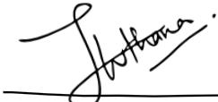
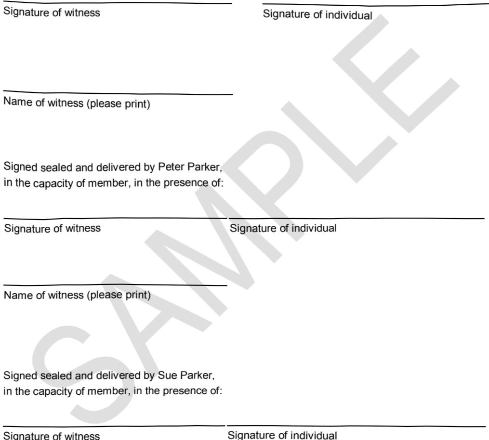

# Superannuation Trust Deed for a Self Managed Fund W 

for 

Ausis Super Fund 

cleardocs.com 770 Industrial Street 5653 Bourke Street Ballarat VIC 3350Tel: 000000000Fax: 03 98869123admin2@cleardocs.com 

Page: 0

## Table of contents

Overview..1  
A Establishment of the fund..2  
The establishment of the fund .2  
Purpose of the fund..2  
Trustee of the fund...2  
Method of decision by trustee under this deed .2  
Deed subject to superannuation law..2  
Trustee must comply with law..2  
B Membership.....3  
Initial members of the fund .3  
Trustee may appoint additional members..3  
Beneficiaries as additional members..3  
Applicant to provide information to trustee..3  
Conditions must be met..3  
Effect of becoming member..4  
Date of commencement of membership of additional member ..4  
Date of additional member's commencement as trustee ..4  
Back-dating of membership...4  
Trustee must notify new member..4  
Trustee must disclose and report..4  
Trustee must notify exiting member .5  
Limit on disclosure..5  
Members must inform trustee of change affecting fund compliance .5  
Members and trustee must ensure fund compliance .5  
Trustee and members must rectify non-compliance..5  
Types of compliance arrangement...5  
Ceasing to be a member...6  
Exception to ceasing to be a member..6  
Minor as a member..6  
c Accounts of the fund..7  
Trustee must establish certain types of account..7  
Credits to accumulation accounts .7  
Debits to accumulation accounts .7  
Contributions-split requests ....8  
Credits to the income account .8  
Debits to the income account ..8  
Tax on income...9  
Distribution from income account...9  
Trustee may establish equalisation account ..9  
Credits to equalisation account.  
  
..10  
Debits to equalisation account.  
  
..10  
Trustee may establish or maintain other accounts or reserves ..10

Page: 1

Valuation of fund .10  
Interim fund earning rate .10  
D Contributions ..10  
Member to keep trustee informed .10  
Member contributions .10  
Employer contributions .11  
Other contributions..11  
How contributions to be made .11  
Late contributions..11  
Failure to contribute...11  
Contributions etc not accepted .11  
Breach of clause headed 'Contributions etc not accepted'..12  
Allocation of contributions..12  
Tax on contributions and shortfall components ..13  
No termination on transfer of business to another employer...13  
E Investment..13  
Authorised investments .13  
Forbidden investments .14  
Strategy .14  
Power to deal with investments .14  
Investment choice by members .14  
Member or beneficiary may choose strategy .14  
Member or beneficiary may not choose particular investments within strategy..14  
Chosen strategies to be monitored..15  
Sub-accounts etc for investment choice .15  
Power to deal with investment choice investments .15  
F Benefits: general ..15  
Limit on payment of preserved payment benefits..15  
When payment of preserved payment benefits allowed .15  
Payment of non-preserved amount .16  
Vesting and compulsory payment..16  
Possible addition to entitlement when member ceases to be member...16  
Anti-detriment payments (former section 295-485 of the Income Tax Assessment Act   
1997).16  
Trustee may retain benefit in fund .16  
Transfer of insurance policy...17  
Trustee may adjust benefits for wrong information .17  
G Pensions: general   
  
.17  
Trustee's power to pay pension   
  
.17  
 Member or beneficiary may choose type of pension   
.17  
Actuarial certificate   
  
.18  
Funding pension through annuity   
  
..18  
Trustee may allocate benefit between 2 or more spouses.  
  
Trustee must establish pension account .. 18  
Credits to pension account...18  
..18

Page: 2

Debits to pension account ...18  
Adjustment based on fund earning rate 19  
Segregation of assets and valuation..19  
Pensions: residue in account..19  
Trustee's right to commute pensions generally .19  
Commutations related to transfer balance caps..20  
Qualification of pensions as asset test exempt income streams..20  
H Death, disability and retirement benefits..20  
Death benefit payments...20  
Death benefit agreement payment arrangements .20  
Binding death benefit notice payment arrangements...21  
Non-binding death benefit notice payment arrangements..21  
Death of member or former member..22  
Discharge of trustee ..22  
Total and permanent disablement benefit .22  
Temporary total disablement benefit.Period of payment: temporary total disablement ::.23.22  
Method of payment: temporary total disablement..23  
Member contributions may be suspended: temporary total disablement..23  
Membership not affected by temporary total disablement..23  
Retirement benefit..23  
Early retirement..23  
Payment of benefit...24  
Trustee must notify that benefit is payable .24  
Method of notice..24  
Claim out of time..24  
Unclaimed benefit .24  
Tax on benefit .25  
Where benefit is payable..25  
Trustee may send benefit to person entitled .25  
Notification of address etc..25  
Receipt to be given .25  
Person under legal disability .25  
Discharge of trustee .25  
Transfer of assets .25  
J Forfeiture of benefit entitlements ..26  
Forfeiture account .26  
K Provisions relating to the Family Law Act ...26  
Payment splits..26  
Rules for payment splits .26  
Deferred payment splits..26  
Flagging agreements..27  
Transfer of non-member spouse interests .27  
Refusal to admit as member..27

Page: 3

L Trustee's powers...27  
All the powers of an individual..27  
Trustee's discretion ..27  
Delegation of power ..27  
Trustee not subject to direction..28  
Specific powers..28  
Limit on borrowing .29  
Trustee may grant security over asset..29  
When borrowing is allowed (including "limited recourse borrowing arrangements") ..29  
Trustee's power to effect insurance .30  
Trustee bound to exercise power in limited cases...30  
Inconsistent conditions in policy....30  
Powers not affected by conflict of interests .30  
Disclosure of conflict of interest .31  
Trustee's power to effect transfer on written request...31  
Form and effect of transfer ..31  
Trustee's power to transfer to eligible roll over fund.Trustee's power to transfer to successor fund .31.31  
Transfer of assets..31  
The trustee's power to receive transfer...32  
M Administration of fund....32  
Dealing with money received..32  
Effect of receipts .32  
Trustee may not charge fees .32  
Trustee entitled to be reimbursed for expenses ..32  
Trustee to keep records and accounts.....33  
Trustee to collect money owing to the fund..33  
Trustee to keep records, accounts, books etc..33  
Documents to be prepared .33  
Annual return ...33  
Audit ..33  
Disclosure requirements...33  
Availability of books and records ..34  
Availability of deed and documents .34  
Appointment of auditor ..34  
Appointment of actuary...34  
Appointment of administration manager..34  
Appointment of investment manager ....34  
Appointment of custodian..34  
Trustee may remove person from office..34  
Trustee not bound by advice ..35  
Liability of the trustee is limited...35  
Indemnity .  
  
.35  
Other persons who may act.  
  
.35  
Appointment of members as trustee   
  
..35

Page: 4

.36  
Appointment of replacement corporate trustee..  
  
Continuity of office...36  
Appointment and resignation of trustee...36  
N Miscellaneous..36  
Trustee may elect to wind up fund..36  
Notice of winding up..36  
Payment etc on winding up...37  
Legal rights of member not affected by this deed .37  
Variation..37  
Limits on effect of variation...37  
Limits on power to vary..37  
Notice of variation..38  
Dispute resolution .38  
SAMP Execution .Schedule to this deed .Interpretation.Proper law.Definitions... 39.38.39.45.46

Page: 5 ## Overview 

For the convenience of users, this superannuation trust deed is written in plain language. It contains  only those clauses that are appropriate for the particular form of self-managed superannuation fund that you have chosen. It is not suitable for any other form of fund.

 If you decide to change the trustees of the fund, for example, replace individual trustees with a You cannot change the form of the fund in any other way.

{"blocks": ["SAMPLE"]}

Page: 6

## The establishment of the fund 

1Each person named as a member in the Schedule to this deed, and each person named as trustee in the Schedule enter into this deed to establish the Ausis Super Fund as a selfmanaged superannuation fund under the SIS Act. It is an indefinitely continuing.superannuation fund.

## Purpose of the fund 

2The sole or primary purpose of the fund is to provide old age pensions and other benefits.to members on their retirement.

## Trustee of the fund 

3The initial trustee is named in the Schedule to this deed. The trustee accepts the. appointment. The fund is vested in the trustee. No other person (including a member) has.any legal or beneficial interest in any asset of the fund except to the extent expressly.stated elsewhere in this deed. The trustee must manage the fund in accordance with this  deed.

## Method of decision by trustee under this deed

4The trustee may only make decisions under this deed in the manner set out in the trustee's constitution.

## Deed subject to superannuation law

5This deed is to be interpreted so as to comply with superannuation law. In particular, it is to  be construed so that the fund it establishes qualifies as a self managed superannuation fund under superannuation law and so that it qualifies for, and payments from it qualify for, all available concessional tax treatment under the Tax Act. To the extent that anything in  this deed is inconsistent with superannuation law, or precludes any available concessional  tax treatment under the Tax Act - including in respect of a payment made under this deed - it is to be severed from the deed. Any obligation or requirement either imposed by  superannuation law in respect of the fund established or evidenced by this deed, or  required to be included to ensure all available concessional tax treatment under the Tax  Act - including in respect of any payment made from the fund - that is not expressed in this deed is nonetheless to be regarded as incorporated in it by reference..

## Trustee must comply with law 

6The trustee must not do or fail to do anything as trustee of the fund that would result in either of the following:

a breach of law, including superannuation law; or.

the fund ceasing to qualify as a self managed superannuation fund under 

Page: 7

superannuation law or to qualify for, or for payments made from the fund to qualify for, all available concessional tax treatment under the Tax Act.

## B Membership 

## Initial members of the fund 

7The initial members of the fund are named in the Schedule. Each of them has completed and signed an 'Application to become a Member' in a form approved by the trustee..

## Trustee may appoint additional members

8The trustee may appoint a person as an additional member of the fund if he or she has.completed and signed an 'Application to become a Member' in a form approved by the.trustee.

The additional member must consent to doing all things necessary to become a director of the trustee of the fund upon appointment unless the additional member is unable to become a director of a trustee under superannuation law.

## Beneficiaries as additional members 

9Subject to clause 10, a person who is to receive a death benefit from the fund in the form of a pension becomes a member of the fund when:.

.the trustee has accepted that person as an additional member; and 

that person has received a pension payment from the fund.

## Applicant to provide information to trustee

10On written request by the trustee, a beneficiary, a member or applicant for membership of.the fund must supply the trustee with information that the trustee thinks necessary for any purpose. This extends to submitting to a medical examination by a doctor who is acceptable to the trustee.

 If a beneficiary, member, or applicant fails to do so, the trustee may decline to accept the  applicant as a member, suspend collection of contributions in respect of that person, may  withhold benefits from that person, impose conditions on that person's membership and/or refuse to accept further contributions in respect of that member, as the trustee thinks fit.

## Conditions must be met 

12 Subject to clause 27, a person does not become an additional member of the fund, and the trustee must not accept a person as an additional member of the fund, unless each of the following conditions is met:

 the total number of members would be no more than the number permitted by  superannuation law;

the person is not disqualified from being a director of the trustee of the fund;

the person is not in an employment relationship with another member of the fund except another member who is also a relative of that person;.

Page: 8

the trustee is satisfied that the person will become a director of the trustee of the fund on being accepted as a member of the fund, as required by superannuation law, or that alternative arrangements satisfactory under superannuation law have been or are to be made.

## Effect of becoming member

An additional member becomes bound by this deed on being accepted as an additional member.

## Date of commencement of membership of additional member

14An additional member's membership commences on the date the trustee specifies, when accepting the person as a member. If the trustee does not specify a date, then the additional member's membership commences on the date the trustee received his or her application or the date referred to in clause 9 (if applicable). The trustee may impose, and subsequently vary, conditions on the membership of a person..

## Date of additional member's commencement as trustee

15An additional member becomes director of the trustee of the fund on the date his or her membership commences provided that the trustee has done everything necessary to appoint the additional member as a director of the trustee. The exception is where. alternative arrangements, satisfactory under superannuation law, have been made relating to an appointment in respect of the member.

## Back-dating of membership 

16With the trustee's consent, the relevant employer may back-date the commencement of an additional member's membership for any period the employer thinks fit. Unless the employer decides otherwise with the agreement of the trustee, that additional period will count as a period of membership..

## Trustee must notify new member

17 As soon as practicable after a person becomes a member of the fund (and not later than  3 months after the person becomes a member), the trustee must ensure that the member is given a product disclosure statement in the form acceptable to the trustee which the. superannuation law requires to be given to new members of the fund. However the trustee. may instead choose to rely on a relevant exemption, available under superannuation law,.to the requirement to provide a product disclosure statement..

## Trustee must disclose and report

18The trustee must ensure that members, former members and beneficiaries are provided with information in writing, or copies of accounts, records and documents of the fund, that the superannuation law requires them to be given.

Page: 9

## Trustee must notify exiting member 

19As soon as practicable after a person ceases to be a member of the fund, the trustee must.ensure that that person (or his or her legal personal representative) is given a written  statement of the information the superannuation law requires to be given to persons who cease to be members of the fund.

## Limit on disclosure 

20A dependant of a member is not entitled to any additional information relating to the  operation or conduct of the fund which the trustee thinks it is inappropriate to disclose.

## Members must inform trustee of change affecting fund compliance 

21A member must immediately inform the trustee if the member becomes aware that either of the following may happen:

the member may enter into an employment relationship with another member who is not also a relative of the member; or 

the member may be disqualified from being a director of the trustee of the fund.

## Members and trustee must ensure fund compliance 

22A member and the trustee must ensure that the member ceases to be a member of the fund within 6 months after either of the following happens:

the member enters into an employment relationship with another member who is not also a relative of the member; or 

the member is disqualified from being a director of the trustee of the fund.

## Trustee and members must rectify non-compliance 

23If a member of the fund enters into an employment relationship with another member who is not also a relative of the member, or becomes disqualified from being a director of the trustee of the fund, the trustee and the members must do whatever is necessary to ensure. that, within 6 months after the member entered into the employment relationship or  became disqualified:

no member of the fund is in an employment relationship with another member who is not also a relative of the member; and 

no member of the fund is disqualified from being a director of the trustee of the fund.

## Types of compliance arrangement 

24The types of things that may be done to ensure compliance include each of the following:

 a member may request the member's benefits or entitlement in the fund to be  paid in accordance with this deed or to be transferred or rolled over to an approved benefit arrangement under clause 142.

 the trustee may transfer a member's benefits or entitlement in the fund to an 

Page: 10

eligible roll over fund under clause 143.

## Ceasing to be a member 

25A person ceases to be a member of the fund as soon as the first of the following happens:

the person dies..

the person ceases to be a director of the trustee of the fund..

when payment of all the member's benefits is made to the member or to an approved benefit arrangement for the member.

when benefits payable to or for the member cease to be payable.

as determined in accordance with any condition imposed as the person's membership under clause 14.

When a person ceases to be a member of the fund, the person ceases to be a director of the trustee of the fund, if he or she has not already ceased to act in that role.

## Exception to ceasing to be a member

26A person (first person) does not cease to be a member of the fund when the first person ceases to be a director of the trustee of the fund if:

another person (second person) has been appointed to act as a director of the trustee of the fund in the place of the first person; and 

that second person is the first person's legal personal representative, while he or she holds an enduring power of attorney in respect of the first person or while the 

## Minor as a member 

27A minor, being a person who is under 18 years of age, may be a member of the fund provided the superannuation law is complied with. In relation to a member who is a minor 

the minor's parent or guardian must make the application for the minor to become a member in a form acceptable to the trustee;.

decisions in relation to the minor's membership must be made by the minor's parent or guardian until:

the minor turns 18; or 

 after the minor turns 16, the time at which the parent or guardian.notifies the fund that the minor will be making decisions in relation to the minor's membership;

 when the minor turns 16, any parent or guardian acting as a director of a corporate trustee in place of the member, may continue acting in that role; and 

 when the minor turns 18, the parent or guardian acting as a director of the trustee of the fund must do everything necessary to procure that the minor be appointed as a director of the trustee of the fund in place of them acting in that role..

Page: 11

## Accounts of the fund 

## Trustee must establish certain types of account 

28The trustee must establish:

 an accumulation account or a pension account, or a combination of both, in  respect of each member or beneficiary for each class; and 

an income account.

## Credits to accumulation accounts 

The trustee may credit, as the trustee thinks appropriate, each of the following to the accumulation account of a member:

29.1Contributions made by or in respect of a member.

29.2Other contributions allowed under this deed and superannuation law that are made in respect of the member.

29.3Positive earnings transferred from the income account.

29.4A shortfall component paid in respect of that member after any tax that is payable in relation to it has been deducted from it.

29.5An amount paid to the trustee as a transfer or roll over payment in respect of that member which the trustee thinks it appropriate to credit to the account.

29.6An amount transferred from the pension account of a beneficiary of the member.

29.7The proceeds of an annuity or insurance policy which relates to the member.

29.8Any other amount the trustee thinks it appropriate to credit to the account, or is required to credit to the account, in accordance with superannuation law.

## Debits to accumulation accounts 

The trustee may debit, as the trustee thinks appropriate, each of the following from the accumulation account of a member:

30.1The expenses of the fund;

30.2Tax payable in respect of contributions or any shortfall component that are paid to the fund;.

30.3A payment of a benefit to or in respect of the member or a beneficiary of the member except a payment from a pension account;

30.4 An amount paid out of the fund in respect of the member or a beneficiary of the member as a transfer or roll over payment;

30.5The cost of any annuity or policy of insurance which relates to the member;

Any negative earnings of the fund determined in accordance with this deed;

An amount determined in response to a release authority in respect of a first home super saver determination;

30.8An amount determined under a COvID-19 determination;

Page: 12

30.9 An amount paid to indemnify the trustee in accordance with this deed;

30.10An amount credited to the pension account of a beneficiary;.

30.11A levy,

30.12 Any other amount the trustee thinks it appropriate to debit or is required to debit in accordance with superannuation law.

## Contributions-split requests 

A member may ask the trustee (in a way that satisfies the requirements of superannuation law) that contributions made to the fund in respect of that member in the previous financial  year be:

31.1allotted to the accumulation account of that member's spouse; or 

31.2 rolled-over or transferred to the trustee of an approved benefit arrangement of which that member's spouse has joined or is eligible to join..

32The trustee must allot, roll-over or transfer the relevant contributions pursuant to a request received under clause 31 provided:

The request satisfies the requirements of superannuation law.

The trustee is satisfied that the allotment, roll-over or transfer complies with superannuation law; and 

The amount of the contributions that the trustee allots, rolls-over or transfers does not exceed the amount in the member's accumulation account, taking into account any amount that the trustee otherwise determines to debit from the member's accumulation account.

## Credits to the income account 

33The trustee may, as the trustee thinks appropriate, credit each of the following to the income account of the fund:

33.1Income and profits of the fund.

33.2Adjustment credits made in accordance with clause 36.

33.3The proceeds of an insurance policy which the trustee decides not to credit to a  member's or beneficiary's accumulation or pension account..

33.4A surplus resulting from a valuation under clause 41..

33.5Financial assistance received by the fund under part 23 of the SIS Act which the.trustee decides not to credit to a member's or beneficiary's accumulation or.pension account.

33.6Any other amount the trustee thinks it appropriate to credit or is required to credit in accordance with superannuation law.

## Debits to the income account 

34The trustee may, as the trustee thinks appropriate, debit each of the following to the income account of the fund:

Page: 13

34.1The expenses of the fund, except those the trustee debits from a member's or.beneficiary's accumulation or pension account.

34.2Tax payable or likely to become payable in respect of contributions, shortfall components, or income and profits of the fund, except tax the trustee debits from a member's or beneficiary's accumulation or pension account.

34.3Adjustment debits made in accordance with clause 36..

34.4The cost of an insurance policy which the trustee decides not to debit from a.member's or beneficiary's accumulation or pension account.

A deficiency resulting from a valuation under clause 41..

The amount of a levy, except an amount the trustee debits from a member's or beneficiary's accumulation or pension account.

34.7Any loss on the disposal of an investment of the fund..

34.8Any other amount the trustee thinks it appropriate to debit or is required to debit.in accordance with superannuation law.

## Tax on income

35The trustee must make provision for the payment of any tax payable in relation to the taxable income of the fund and must deduct any tax that is payable and that has not.already been deducted from the income account or an accumulation or pension account.

## Distribution from income account 

36At the end of each fund year, the trustee must determine the fund earning rate. The trustee must allocate amounts from the income account to each accumulation or pension account in proportion to the amount standing to the credit of that account at the beginning of the.relevant fund year. The trustee must make an appropriate adjustment for any amount.credited or debited to the account since the beginning of that year.

## Trustee may establish equalisation account 

The trustee may, as the trustee thinks appropriate, establish an equalisation account which the trustee may use for any of the following purposes:

37.1To give effect to the reserving strategy the trustee establishes to smooth the investment earnings of the fund.

37.2To increase the fund earning rate.

37.3To pay tax payable by the fund.

37.4To pay the expenses of the fund.

37.5To provide for any contingencies the trustee decides to provide for..

37.6To provide an amount to or for a member, former member, pensioner,.

 beneficiary, including adding to an accumulation or pension account, provided 

there is no breach of superannuation law.

37.7To do anything else the trustee decides to do, provided there is no breach of trust.or superannuation law..

Page: 14

## Credits to equalisation account 

38The trustee may credit the equalisation account, as the trustee thinks appropriate, with any of the following:.

The portion the trustee thinks fit of an amount paid into the fund as a transfer or roll over payment..

An amount transferred from a pension account under clause 84.

Any other amount the trustee thinks it appropriate to credit or is required to credit.in accordance with superannuation law.

## Debits to equalisation account

The trustee may debit the equalisation account, as the trustee thinks appropriate, with any amount the trustee thinks appropriate to debit or is required to debit in accordance with.superannuation law.

## Trustee may establish or maintain other accounts or reserves 

40The trustee may establish or maintain any other account for or reserve of the fund that the trustee thinks necessary or desirable or that is required or permitted by superannuation law. The trustee may use such accounts or reserves for any purpose permitted by.superannuation law and may credit or debit amounts from such accounts or reserves as.the trustee sees fit.

## Valuation of fund 

41The trustee must value the assets of the fund at market value when superannuation law requires it and when the trustee thinks it appropriate to do so. The trustee may also.determine whether there is a surplus or deficiency which it is equitable in the trustee's opinion to transfer to the income account..

## Interim fund earning rate

 If the trustee is required to establish an interim fund earning rate, the trustee must do so in.accordance with superannuation law on a basis the trustee believes to be equitable. If the Regulator or superannuation law requires it, the trustee must inform members of that  basis.

## D Contributions 

## Member to keep trustee informed 

43A member must tell the trustee as soon as practicable if they are aged 65 or older and.cease gainful employment.

## Member contributions 

44With the trustee's consent, a member may make any contributions (or procure that any  contributions are made) to the fund that the member decides to, which includes downsizer 

Page: 15

contributions. With the member's and the participating employer's consent, contributions can be paid by deduction from wages or salary. In that case, the member's employer must.pay them to the fund in the way the trustee directs.

## Employer contributions 

45An employer of a member may make any contributions to the fund in respect of that member that the trustee and the employer agree to.

## Other contributions 

46With the consent of the trustee and the member, any other person including:

a spouse of that member;.

another member;

 another trustee of a regulated superannuation fund (including pursuant to a contributions-split requested by the member's spouse);.

 any State, Territory or Federal government (including under the Federal government's co-contribution scheme) or authority;

may make contributions to the fund in respect of that member.

## How contributions to be made 

47A contribution to the fund must be made in the way the trustee directs. It must be made.within the time specified by superannuation law. It may be made in cash, or by the transfer.of assets in accordance with superannuation law. The only assets that may be transferred are those that are authorised investments under clause 57.

## Late contributions 

48Despite clause 47, if the trustee agrees then an employer may make an employer contribution after the time the superannuation law requires the payment to be made. If the trustee agrees, and the employer makes the payment, this does not relieve the employer's liability to pay any additional charges or penalties arising under superannuation law.because of the late payment..

## Failure to contribute

49In the absence of an agreement, neither a member nor his or her employer is under an. obligation to make a contribution to the fund in respect of that member. A failure to do so does not affect the member's membership of the fund.

## Contributions etc not accepted

50The trustee must use reasonable endeavours not to accept any of the following:

a contribution that is not permitted by superannuation law;.

 a contribution or shortfall component the acceptance of which would prevent the  fund from qualifying as a complying superannuation fund; and.

Page: 16

an employer contribution or shortfall component which the regulator lawfully directs the trustee not to accept.

## Breach of clause headed 'Contributions etc not accepted'

51If the trustee becomes aware that a contribution or shortfall component of the nature.referred to in clause 50 has been accepted, then the trustee will use all reasonable.endeavours to refund the amount to the extent required by, within any time specified by,.and only as permitted by, superannuation law. However, the trustee may deduct each of the following from that amount:

any amount which an insurer may have charged in respect of any extra cover.provided on the basis of the contribution or shortfall charge;.

.reasonable administration charges; and 

any other amount the trustee considers appropriate, acting reasonably..

The trustee may reduce the benefits of the member to those which the member would have had if the contribution or shortfall component had not been accepted..

## Other contributions not accepted 

## 52 The trustee may refuse to accept:

a contribution that the trustee has determined not to accept because the trustee.has not been informed of the relevant member's tax file number; and/or.

excess contributions.

## Permissible actions if excess contributions accepted

53 If contributions of the nature referred to in clause 50 and clause 52 are made to the fund by or in respect of a member, then the trustee may in appropriate circumstances:

release funds to the member or the Commissioner of Taxation if the trustee has received a release authority; and 

release funds in any other circumstances, and to such persons, as is permitted under superannuation law.n 

## Allocation of contributions 

54 If the trustee receives a contribution in a month, the trustee must allocate the contribution.to the relevant member of the fund:

within 28 days after the end of the month, or any other period as required by.superannuation law (relevant period); or 

if it is not reasonably practicable to allocate the contribution to the relevant. member of the fund within the relevant period -- within any longer period as is reasonable in the circumstances.

{"blocks": ["●●"]}

Page: 17

## Tax on contributions and shortfall components 

55Either the trustee, a member's employer or other appropriate body may (and must if required by superannuation law) deduct any tax that is payable in relation to any contribution or shortfall component before it is credited to the member's accumulation account.

## No termination on transfer of business to another employer 

56If an employer amalgamates with another employer or disposes of its business to another  employer, members who were employees of the former employer are deemed for the  purposes of this deed to have become employees of the latter employer, which may then make contributions in respect of them.

## E Investment 

## Authorised investments 

57The trustee must invest any assets of the fund that are not required for payment of benefits or other amounts under this deed. The trustee must do so in accordance with the current investment strategy or strategies. The following are the types of investment in which the assets may be invested:

57.1 Investments in which it is permissible to invest trust funds under the law of any  jurisdiction in Australia.

57.2 Securities in any company incorporated anywhere, whether carrying on business in Australia or not.

57.3Deposit (whether secured or not) with a bank, friendly society, building society,credit co-operative, trustee company, or other registered financial institution.

57.4Real or personal property, including an improvement to that property.

57.5Units (including sub-units) in a unit trust established or situated anywhere in the world by subscription or purchase (including joint subscription or purchase).Whether the units are fully paid or partly paid, and whether their issue involves a contingent or reserve liability is irrelevant.

57.6Derivatives such as futures, forwards, options, warrants, swaps or any other synthetic investment.

57.7Synthetic instruments or blockchain technology, including any form of cryptocurrencies.

57.8Hedging, swapping or any similar arrangement, even though it is not linked to any property of the fund.

57.9Deposit (whether secured or not) with, or loan (whether secured or not) to, any  person (including an employer) on any terms the trustee thinks reasonable. The fact that the trustee has a direct or indirect interest in the deposit or borrowing or may benefit directly or indirectly from it is irrelevant.

57.10A policy or annuity with an insurer, whether by proposal or purchase.

57.11Instalment warrants or receipts.

Page: 18

57.12By way of a limited recourse borrowing arrangement in accordance with clause 133.

57.13 Any other investment allowed by superannuation law that the trustee thinks appropriate.

## Forbidden investments 

The trustee must not invest in any investment that is forbidden by superannuation law. The.trustee must not make an investment in the form of a loan or other financial assistance to a member or a relative of a member.

## Strategy 

The trustee must formulate one or more investment strategies for the fund in accordance.with superannuation law. The trustee must inform members and beneficiaries of the strategies adopted by the trustee. The trustee may review and change a strategy at any time. The trustee must continually monitor the strategies to ensure that they remain appropriate.

## Power to deal with investments 

60The trustee may sell, transfer or vary any investment at the trustee's absolute discretion in accordance with this deed. The trustee must do so in the interests of members and beneficiaries. The trustee must continually monitor the investments to ensure that they remain appropriate.

## Investment choice by members 

The trustee may decide to allow one or more members or beneficiaries to choose between investment strategies. If the trustee does this, the trustee must establish a range of possible investment strategies, and may designate particular assets for those strategies.The trustee must provide the members or beneficiaries with information concerning the.strategies and the relevant investment objectives to enable the member or beneficiary to choose between them on an informed basis. The trustee must also provide them with  information concerning their rights under this deed.

## Member or beneficiary may choose strategy 

62A member or beneficiary who has been offered investment choice by the trustee may  choose one or more of the strategies prepared by the trustee by completing any  documents the trustee requires. On having done so, the member or beneficiary may direct  the trustee to invest any part of the fund that is held for that person in accordance with those strategies. Any direction must be in accordance with superannuation law.

## Member or beneficiary may not choose particular investments within strategy 

63A member or beneficiary who has directed the trustee to invest any part of the fund that is  held for that person in accordance with those strategies may not direct the trustee to invest  in any particular investment. However, the member or beneficiary may request the trustee 

Page: 19

to develop an investment specific strategy and to make it available to that member or.beneficiary. The trustee may accept or reject the request.

## Chosen strategies to be monitored 

64The trustee may continually monitor any strategies adopted by members or beneficiaries.

for investment choice to ensure that they remain appropriate for the members or.

beneficiaries to whom they are available.

## Sub-accounts etc for investment choice 

 If a member adopts a strategy for investment choice, the trustee may do each of the.following:

65.1Establish a sub-account of the income account in respect of that strategy..

65.2Credit and debit that sub-account in relation to any amount attributable to that strategy as if it were the income account itself.

65.3Allocate earnings attributable to that strategy to the member's or beneficiary's  accumulation account or pension account in a way that the trustee thinks equitable.

65.4Determine a fund earning rate for that sub-account.

## Power to deal with investment choice investments

66The trustee may sell, transfer or vary any investment made in accordance with a strategy for investment choice, at the trustee's absolute discretion in accordance with this deed.The trustee must do so in the interests of the relevant members or beneficiaries. The trustee must continually monitor the investments to ensure that they remain appropriate..

## F Benefits: general 

## Limit on payment of preserved payment benefits 

The trustee must not pay out to a member or a dependant of a member any preserved  payment benefit that superannuation law does not allow the trustee to pay out..

## When payment of preserved payment benefits allowed 

68The trustee may pay to a member, or in respect of a member to another person as  permitted by superannuation law, a preserved payment benefit in any of the following.circumstances:

68.1The member reaches the relevant preservation age and takes a transition to retirement pension in accordance with Part G.

68.2The member retires from gainful employment on or after reaching the relevant. preservation age.

68.3The member becomes totally and permanently disabled.

68.4The member becomes totally and temporarily disabled.

Page: 20

68.5The member reaches age 65.

68.6The member dies.

68.7The member has obtained a release authority in respect of a first home super saver determination.

68.8The member has obtained a COvID-19 determination to assist the member to deal with the adverse economic effects of the coronavirus known as COviD-19.68.9Any other circumstance allowed by superannuation law.

## Payment of non-preserved amount 

With the trustee's consent, a member may withdraw any part of the non-preserved amount in the member's accumulation account. The member must apply to the trustee in writing for the withdrawal in a form acceptable to the trustee. The trustee may set a minimum withdrawal amount by notifying the members of the fund.

## Vesting and compulsory payment

70A member's benefit entitlement will vest in accordance with superannuation law. The trustee must cash or commence to cash a member's benefit entitlement as soon as practicable after the member dies or the entitlement has vested. If a lump sum is payable,the trustee may pay it in several stages: an initial payment and then subsequent payments.

## Possible addition to entitlement when member ceases to be member 

71 If a member ceases to be a member of the fund, the trustee may pay an amount that the.trustee thinks appropriate from the equalisation account (if any) into the member's accumulation account.

## Anti-detriment payments (former section 295-485 of the Income Tax Assessment Act 1997) 

Where the trustee is to make a payment because a member has died (a death benefit), the trustee may pass on to the recipient of that payment any benefit that would accrue to  the fund if a deduction were allowed under former section 295-485 of the Income Tax Assessment Act 1997. The trustee may only do so where the member died prior to 1 July  2017. In any case, the trustee may not do so in respect of any benefits paid on or after 1 July 2019.

## Trustee may retain benefit in fund 

73 If a member or beneficiary requests it, the trustee may retain any part of a benefit in the fund. The trustee may do so until one of the following occurs:

73.1The member or beneficiary decides otherwise.

73.2The member or beneficiary dies.

73.3The amount has to be paid under this deed or superannuation law.

73.4The trustee decides otherwise..

Page: 21

Subject to Part H, the payment the trustee then makes must be the amount standing to the credit of the member's or beneficiary's accumulation and pension account(s) at that time.

## Transfer of insurance policy 

74 If a member or beneficiary is entitled to a benefit which includes an interest in an insurance.policy, the trustee may assign that policy to the member or beneficiary, or to any of the dependants of the member the trustee thinks fit. The trustee must debit the value of the policy to the relevant accumulation or pension account. Neither the trustee nor an employer is liable for any further payment of premiums in relation to the policy.

## Trustee may adjust benefits for wrong information 

75The trustee may adjust any benefit payable to or in respect of a member if an applicant,. member or beneficiary has supplied false or misleading information to the trustee, or has.deliberately withheld information from the trustee, that affects or is likely to affect benefits payable to or in respect of that member.

## G Pensions: general 

## Trustee's power to pay pension 

76When any part of a benefit becomes payable to a member under this deed or in accordance with superannuation law, the trustee has a discretion to decide whether to pay  one or more pensions to the member or to use the benefit payable to acquire one or more  annuities in the name of the member. The pensions or annuities may be of any type permitted by superannuation law (including, without limitation, an account-based pension)and will be in substitution for the relevant part of any lump sum benefit that was payable to the member for the amounts credited to the member's pension account as a transfer of a roll over payment under clause 83.2.

## Member or beneficiary may choose type of pension 

The relevant member or beneficiary may choose the type of pension that is to be paid, including a transition to retirement pension. However, the pension must be of a type that is  allowed by superannuation law or is acceptable to the Regulator. It may include a pension:.77.1 wholly determined by reference to policies of life assurance purchased or obtained by the trustee of a regulated superannuation fund solely for the purposes of providing benefits to members of that fund; or 

77.2to be commenced from an amount accepted into the fund by the trustee as a transfer or roll-over on the death of a person in respect of whom the member is a. dependant, and which amount must be applied for the payment of a pension to the member.

A pension must be paid in accordance with the requirements of the superannuation law.

Page: 22

## Actuarial certificate 

79The trustee must obtain an actuarial certificate in accordance with superannuation law in  relation to any pension that the trustee decides to pay, unless the Tax Act provides  otherwise in which case the trustee has a discretion as to whether to obtain an actuarial certificate.

## Funding pension through annuity 

80The trustee may fund a person's pension by purchasing an annuity payable to the trustee.

## Trustee may allocate benefit between 2 or more spouses

81 If there are 2 or more spouses of a member, the trustee may decide in what proportion.each is entitled to a benefit payable under this deed to the member's spouse.

## Trustee must establish pension account 

82 If the trustee decides to pay a pension to a person in accordance with this deed or is required to by superannuation law, then the trustee must establish a pension account in.the name of that person.

## Credits to pension account 

83The trustee may credit, as the trustee thinks appropriate, each of the following amounts to the person's pension account, subject to superannuation law:.

83.1The amount necessary to fund the pension.

83.2The amount paid into the fund in respect of the pensioner as a transfer or roll over payment.

83.3Earnings of the fund.

83.4A shortfall component paid in respect of the pensioner.

83.5Contributions lawfully paid in respect of the relevant member..

83.6Adjustment credits made in accordance with clause 36..

83.7Credits from the equalisation account or any other account or reserve of the fund;.

83.8The proceeds of an annuity or insurance policy in respect of a pensioner.

83.9Any other amount the trustee thinks it appropriate to credit or is required to credit.in accordance with superannuation law.

## Debits to pension account 

84The trustee may debit, as the trustee thinks appropriate, each of the following amounts to the person's pension account, subject to superannuation law:.

84.1Expenses of the fund.

84.2Any negative earnings of the fund determined in accordance with clauses 36, 65or 85.

84.3The proportion of the loss on the disposal of investments of the fund..

Page: 23

84.4 Amounts transferred from the fund in respect of the pensioner as a transfer of a roll over payment..

84.5 Payments made to or in respect of the pensioner or a reversionary beneficiary under this deed..

The cost of an insurance policy or annuity in respect of the pensioner which are not debited from the member's accumulation account.

84.7 The proportion of an amount payable as taxation in respect of the earnings of the fund that are credited to the pensioner's account or arise from a roll over  payment.

84.8The proportion of an amount paid in respect of an indemnity to the trustee or other person under this deed..

84.10An amount transferred to the accumulation account of a beneficiary..

84.11 Any other amount the trustee thinks it appropriate to debit or is required to debit 

in accordance with superannuation law..

## Adjustment based on fund earning rate

 In determining the amount standing to the credit of an accumulation account at the time a  benefit or pension is calculated or becomes payable, the trustee may make an adjustment to the account that the trustee thinks equitable on the basis of the interim fund earning rate at that date. The adjustment must be made in respect of the period from the beginning of the current fund year to the relevant date. The income account must be credited or debited accordingly.

## Segregation of assets and valuation 

86The trustee may segregate from other assets those assets which are to fund the pension of a person under this deed and value those assets as required by superannuation law..

## Pensions: residue in account

87On the death of a pensioner being paid a pension the trustee must, subject to superannuation law:

 act in accordance with the terms on which the relevant pension is paid, including  as to the payment of the pension to a reversionary beneficiary; and.

then, if there is no reversionary beneficiary, or if there is any residue in the pension account for any other reason, pay that residue as a death benefit in accordance with Part H of this deed..

## Trustee's right to commute pensions generally

88On written request by a pensioner, or in accordance with superannuation law or this deed,the trustee may commute all or any part of a pension and apply the proceeds of that 

Page: 24

 sum and paying it to the relevant person, to his or her estate or to a third party as required.by the terms of a release authority.

## Commutations related to transfer balance caps 

89If:

89.1a member has or is likely to exceed that member's transfer balance cap, or the trustee or member has received a transfer determination in respect of a member;or 

89.2the member is to be paid a new pension either from the fund (including from an amount transferred into or rolled-over into the fund on the death of another person) or from another fund,

then the trustee and member will work together to decide whether any, and if so which, of the member's pensions will be commuted in whole or in part, taking into account the member's transfer balance cap.

## Qualification of pensions as asset test exempt income streams

90The trustee may decide that a pension should qualify as an asset test exempt income.stream (as that term is defined by the Social Security Act 1991). If the trustee so decides:

90.1the superannuation law prevails over the terms of this deed to the extent of any inconsistency;

90.2 this deed is deemed to contain any provision that is required by superannuation. law, and 

90.3this deed is deemed not to contain any provision that is required to be excluded by superannuation law.

## H Death, disability and retirement benefits 

## Death benefit payments 

The trustee may pay the death benefit on the death of a current member of the fund. The trustee can do that under:

91.1a death benefit agreement, clause 93;

91.2a binding death benefit notice, clause 95; or 

91.3a non-binding death benefit notice, clause 96.

92In the ways set out in this Part H, the trustee must pay the full amount standing to the credit of the accumulation account, and any pension account residue referred to in clause 87, either as a lump sum, or as one or more pensions or annuities, or both.

## Death benefit agreement payment arrangements 

93On the death of a member or beneficiary who has a death benefit agreement:.

93.1the death benefit agreement prevails over clause 95 and over any binding death benefit notice or non-binding nomination form;

Page: 25

93.2the trustee must pay, or apply, the relevant benefit in accordance with the rules set out in the death benefit agreement; and.

93.3Part I of this deed applies to the payment of the relevant benefit..

A death benefit agreement need be executed only by the trustee and the relevant member or beneficiary. On execution, the terms of any death benefit agreement form part of this deed. They are to be read together with this deed and in accordance with the following rules:

94.1a death benefit agreement replaces any previous death benefit agreement;.

94.2 if there is a death benefit agreement, then any binding death benefit notice is to.be treated as not in effect for the purposes of this deed and of regulation 6.17A(4) of the SIS Regulations (but see also clause 94.4 which can overrule this clause);

94.3if there is any inconsistency between the death benefit agreement and the.remaining provisions of this deed, then the terms of the death benefit agreement.prevail to the extent of that inconsistency -- except that clause 5 of this deed prevails over the agreement; and 

94.4if part of the death benefit agreement is invalid because it directs the trustee to.pay part, or all, of the benefits to a person to whom those benefits may not be paid in accordance with superannuation law (disallowed benefits) then:.

clause 94.2 does not apply in respect of the disallowed benefits;

clauses 93 and 94.1 to 94.3 apply to any part of the death benefit  agreement which remains valid (and to the payment of death benefits other than disallowed benefits); and 

clauses 94.1 to 94.3 apply for the purpose of determining the disallowed benefits, and the disallowed benefits must be paid in.accordance with the remainder of this Part H..

## Binding death benefit notice payment arrangements 

After the death of a member or beneficiary who has given the trustee a binding death  benefit notice, the trustee must comply with that notice subject to clauses 93 and 94..

## Non-binding death benefit notice payment arrangements 

 If after the death of a member or beneficiary, not all death benefits have been paid or. applied in accordance with a death benefit agreement or binding death benefit notice, then.the trustee must pay or apply the relevant benefit in the way the trustee thinks fit in accordance with the following rules:

96.1If the member or beneficiary has left dependants, then the trustee must pay or  apply the benefit to or for the benefit of any one or more of the dependants of the  member or beneficiary and the legal personal representatives of the member or  beneficiary. The trustee may do so in any proportions the trustee thinks fit, may take into account a member's wishes contained in a non-binding nomination form and may pay the benefit to the member's legal personal representative if satisfied that will be to the benefit of one or more of the member's dependants..

Page: 26

96.2If the member or beneficiary has not left any dependants but does have a legal  personal representative, then the trustee must pay the benefit to the legal. personal representatives of the member or beneficiary.e 

96.3 If the member or beneficiary has not left any dependants and has no legal  personal representative, then the trustee may pay or apply the benefit to or for the benefit of any individual at the trustee's discretion. The trustee may do so in any proportions the trustee thinks fit..

96.4 If the trustee has not paid or applied the benefit to or for the benefit of any person under the preceding sub-clauses 96.1 to 96.3, then the trustee must treat the.benefit as a forfeited benefit entitlement..

## Death of member or former member 

97If a member or former member who has become entitled to a lump sum benefit dies before the payment is made, then the trustee must pay the amount in accordance with clauses 93to 96.

## Discharge of trustee

98 If a dependant, legal personal representative, relative or other person receives any part of a benefit in accordance with clauses 93 to 97, then that discharges the trustee from liability.in relation to the benefit. The trustee is not responsible for seeing how the benefit is.applied.

## Total and permanent disablement benefit

99The trustee must pay a benefit to a member whom the trustee believes to be totally and permanently disabled unless requested otherwise by the member. The benefit may be either of the following:

A lump sum equal to the full amount standing to the credit of the accumulation.account of the member; or.

One or more pensions or annuities representing that amount..

## Temporary total disablement benefit 

100The trustee must pay a benefit to a member whom the trustee believes to be temporarily.totally disabled unless requested otherwise by the member. The benefit must be in the.form of a pension or annuity that represent the following amounts:

In the case where the trustee is entitled to a benefit under an insurance policy in  relation to the member's temporary total disablement, the amount payable to the  trustee.

In any other case, the amount decided by the trustee, provided it does not reduce the minimum withdrawal benefit of the member under superannuation law.

The member is not entitled to commute any part of this benefit.{"blocks": []}

Page: 27

## Period of payment: temporary total disablement

101The trustee must cease paying the benefit for temporary total disablement:

In a case where the trustee is entitled to benefit under an insurance policy in  relation to the member's temporary total disablement, when the trustee ceases to be entitled to that benefit..

In any other case, when the member ceases to be temporarily totally disabled, or reaches normal retirement age, or becomes entitled to another benefit under this deed or requests that the benefit ceases to be paid..

## Method of payment: temporary total disablement

102The trustee must pay the benefit in respect of temporary total disablement in the following way:

In a case where the trustee is entitled to benefit under an insurance policy in relation to the member's temporary total disablement, in the way the benefit is paid by the insurer..

In any other case, in the way the trustee decides..

## Member contributions may be suspended: temporary total disablement 

103A member may suspend his or her contributions during a period while he or she is receiving a benefit in relation to temporary total disablement..

## Membership not affected by temporary total disablement

104A member does not cease being a member because he or she is receiving a benefit in respect of temporary total disablement.

## Retirement benefit 

105The trustee may pay a member the retirement benefit at the member's request if either of the following applies:.

the member retires from employment on or after reaching normal retirement age;or 

the member becomes entitled under superannuation law to the payment of a benefit despite still being employed.

The trustee must pay the benefit in any form permitted by superannuation law, including in  the form of one or more lump sums representing the amount standing to the credit of the member's accumulation account. However, the trustee may also use part, or all, of that  amount to purchase one or more pensions or annuities decided on in consultation with the member. The trustee must immediately inform members of the election..

## Early retirement 

On request by a member, the trustee must pay a benefit to that member in each of the following cases:

Page: 28

the member ceased to be employed before normal retirement age, but has reached the relevant preservation age.

the member, having reached 60 or another age prescribed by superannuation.law, retired from an arrangement under which the member was gainfully employed.

in any other case as permitted by superannuation law.

The trustee must pay the benefit in any form permitted by superannuation law, including in the form of one or more lump sums representing the amount standing to the credit of the member's accumulation account. However, the trustee may also use part, or all, of that.amount to purchase one or more pensions or annuities decided on in consultation with the member. The trustee must immediately inform members of the election.

## 1 Payment of benefit 

## Trustee must notify that benefit is payable

107The trustee must give notice that a benefit is payable to the following persons:

If the benefit is payable to or in respect of a member, to that member.

 If the benefit is payable to, or in respect of a member who is under a legal disability, to the legal personal representative of that member.

If the benefit is payable on the death of a member, to the nominated beneficiary,the reversionary beneficiary and to the legal personal representatives of the member and known dependants of the member and any other person the trustee reasonably believes may have an entitlement or interest in the benefit.

In any other case, any persons the trustee reasonably believes may have an entitlement or interest in the benefit..

## Method of notice 

The trustee must give a person written notice of the time within which that person may  claim an entitlement to the benefit and of how to make that claim. If the person satisfies the  trustee that he or she is entitled to a benefit, the trustee must notify any persons to whom a  notice was required to be sent under clause 107 to enable them to object to a payment to that person. If no objection is received or the specified period for objecting has passed, the trustee must pay the relevant part of the benefit to that person.

## Claim out of time 

109If a person makes a claim out of time to an entitlement to a benefit, the trustee is not bound to make any payment to that person.

## Unclaimed benefit 

110The trustee must give the Regulator a statement of any unclaimed benefits and must pay them to the Regulator as required by superannuation law.

Page: 29

## Tax on benefit 

111Either the trustee or an insurer or other appropriate body must deduct any tax that is payable in relation to a benefit before that benefit is paid.

## Where benefit is payable 

112A benefit is payable at the trustee's principal office, or at a substitute place the trustee.notifies to the member or beneficiary.

## Trustee may send benefit to person entitled 

113The trustee may send a benefit to the postal address that the person entitled to it has last.notified to the trustee, or to the bank account into which that person has asked the benefit to be paid, or to some other place the trustee decides on.

## Notification of address etc 

114A person to whom a benefit becomes payable must notify the trustee of his or her full.residential address, and of any change in that address. He or she must also notify the.trustee of a bank account into which he or she asks the benefit to be paid..

## Receipt to be given 

115On request by the trustee, a person to whom a benefit is paid must give the trustee a receipt and release for the payment in the form required by the trustee.

## Person under legal disability 

116 If a person to whom the trustee is to pay any part of a benefit is under a legal disability, or the trustee believes that it would be in that person's best interests for the trustee not to make the payment to that person, the trustee may make the payment in any of the following ways as the trustee thinks fit:

To or for the maintenance, education, advancement, support or benefit of the person on any conditions.

To, and for the benefit of, another person who appears to the trustee to be any of.the following: the trustee, spouse, child, parent or guardian of the person, or a.person having custody of that person.

## Discharge of trustee 

117The receipt by a person of a payment in accordance with clause 116 discharges the trustee from liability in relation to it. The trustee is not responsible for seeing to its application.

## Transfer of assets 

118With the consent of a member or beneficiary to whom a benefit is payable, the trustee  may, instead of paying or transferring cash, transfer investments of equivalent value to the  member or beneficiary or to the trustee of the relevant approved benefit arrangement.{"blocks": []}

Page: 30

## Forfeiture of benefit entitlements 

Note: Forfeiture accounts are now generally prohibited. Maddocks recommends that you seek.professional advice before establishing such an account.

## Forfeiture account 

119The trustee may establish or maintain a forfeiture account into which the trustee must pay any amount forfeited under this deed. Money held in that account does not form part of an accumulation account. The trustee must operate the forfeiture account in accordance with superannuation law requirements.

## K Provisions relating to the Family Law Act 

## Payment splits 

120 If the trustee receives a splitting agreement or court order under Part VillB of the Family.Law Act, then provided the agreement or court order has been properly served and subject.to superannuation law, the trustee may:

vary the relevant member's benefit or benefit entitlement on such bases.(including by commutation of any pension having regard to the advice of an actuary) and at any time the trustee determines from time to time, to the extent permitted by superannuation law; and 

make a payment to the non-member spouse or a transfer in respect of the nonmember spouse in accordance with clause 124.

## Rules for payment splits 

121The trustee may as it determines from time to time subject to superannuation law, make rules dealing with:.

the valuation of a non-member spouse's benefit or benefit entitlement (including any adjustments);

the timing of the calculation of the non-member spouse's benefit or benefit entitlement;

other matters relating to the payment split or the non-member spouse's benefit or benefit entitlement.

## Deferred payment splits 

122 If the trustee is required by superannuation law or considers that it is appropriate to defer  giving effect to a payment split, then provided the splitting agreement has been served properly, the trustee must:

record the existence of the agreement or court order; and.

keep a record of the non-member spouse's benefit or benefit entitlement on such. basis (including a notional basis) and in such manner as the trustee determines.from time to time subject to superannuation law.

{"blocks": [".."]}

Page: 31

## Flagging agreements

123 If the trustee receives a flagging agreement or court order under Part VillB of the Family Law Act, then provided the agreement or court order has been properly served, the trustee must:

record the existence of the agreement or court order; and 

.defer payment of the benefit to or in respect of the relevant member until the agreement or court order is lifted.

## Transfer of non-member spouse interests 

124If the trustee receives a splitting agreement or court order under Part VillB of the Family Law Act, the agreement or court order has been validly served, then if any amount becomes payable in respect of the non-member spouse under that agreement or order:

the trustee must pay that amount to the non-member spouse -- if the nonmember asks for that payment in writing; or 

the trustee must transfer that amount to another fund (including an eligible rollover fund) in respect of that non-member spouse if the non-member asks for that transfer in writing..

Any payment amount under this clause must be in accordance with superannuation law.The receipt by the non-member spouse or the trustee of that other fund will sufficiently discharge the trustee of its liability in respect of that non-member spouse.

## Refusal to admit as member 

125Provided that the trustee acts in accordance with superannuation law, the trustee may refuse to admit a non-member spouse as a member of the fund.

## L Trustee's powers

## All the powers of an individual 

The trustee has all the powers in relation to the assets of the fund that the trustee would have if the trustee were the legal and beneficial owner of those assets. It also has allthe  powers that a trustee has at law and the powers specifically conferred on the trustee by this deed.

## Trustee's discretion

127The trustee has an absolute discretion in relation to exercising or not exercising any power under this deed or at law, and in relation to the way in which any power is exercised. The trustee's decision on such a matter is final and binding.

## Delegation of power

128The trustee may delegate to another person, including one or more directors of the trustee,any power or duty on any terms the trustee thinks fit, including by appointing an attorney 

Page: 32

under a power of attorney. The trustee may alter or revoke any delegation including any.power of attorney.

## Trustee not subject to direction

129The trustee is not subject to direction in exercising any power under this deed or at law,except to the extent indicated under superannuation law.

## Specific powers 

To exclude any possible doubt, the trustee has the power to do any of the following to the extent allowed by superannuation law:.

130.1To underwrite or sub-underwrite risks, contingencies or liabilities under a superannuation arrangement conducted by an employer under an agreement for the transfer of employees to the fund..

130.2To purchase, acquire, sell, transfer, dispose of, deal in or enter any contract in respect of, any investment comprising synthetic instruments or blockchain technology, including any form of cryptocurrencies.

130.3To enter into any derivatives contract, or purchase, sell or deal in any derivatives product, and otherwise to do and perform all things so as to operate, use or deal with facilities of any stock or futures exchange, either directly or through any broker or agent in any market anywhere in the world.

130.4To purchase, acquire, sell, transfer, dispose of or deal in any shares, stocks,.debentures, notes, bonds, mortgages, options, swaps, forwards, futures,warrants or other form of interest in or securities of a government authority or company, body corporate, scheme or trust and any other contractual or other rights or obligations over or in respect of those securities.

130.5To indemnify a person..

130.6To provide any guarantee or indemnity for payment of money or for the performance of any person's contractual obligations.

130.7To purchase, acquire, sell transfer, hire, lease, dispose of, manage divide,encumber or otherwise deal with any real or personal property.

130.8To sell, transfer, hire, lease, dispose of, manage, divide or otherwise deal with any assets of the fund..

130.9To purchase, acquire vary, sell, transfer or dispose of any deferred property or rights, or any life, life endowment, term or other policy, and to make any relevant payment or pay any premium from the assets of the fund.

130.10To exercise all rights and perform all duties associated with the trustee holding  shares, stock, or debentures in any company an interest of any kind in a company, body corporate, scheme, trust or government authority.

130.11To establish, purchase, acquire, promote or conduct any company, business, either solely or with any person and to sell, transfer, dispose of or wind up any such company, business, undertaking or scheme..

Page: 33

130.12  To appropriate, wholly or partly, any asset of the fund in satisfaction of any.interest a person may have in the assets of the fund or any benefit which the.trustee determines to pay to or apply for the benefit of, a beneficiary..

130.13To value, or engage a person to value, in whole or in part, the assets or any asset of the fund.

130.14To give receipts for money received.

130.15To grant options in respect of any of the assets of the fund.

130.16To receive any real or personal property by gift or by will as additions to the.assets of the fund.

130.17To divide the assets in their own particular form, without first realising those assets, between the trust fund and any other trusts established under this deed 130.18

130.19To enter into, manage and vary any arrangement relating to currency exchange,interest rates, interest rate caps, collars, floors or swaps, any currency forward rate agreement and any other financial risk management arrangement.

130.20To open and operate bank accounts in the usual way, and to draw, make,accept, endorse, discount, execute, issue or otherwise deal with all forms of  negotiable or transferable instruments and to enter into any bill facilities or other form of banking facilities.

130.21 To do anything the trustee considers necessary or desirable in connection with performing its obligations under this deed..

## Limit on borrowing 

131 The trustee must not (except as provided by this deed in clause 133 and superannuation law):

131.1borrow money; or 

131.2maintain an existing borrowing of money..

## Trustee may grant security over asset 

132The trustee may, to the extent allowed by superannuation law, mortgage, pledge, charge, assign or otherwise provide as security, any asset of the fund for the purpose of the trustee. borrowing or maintaining a borrowing of money including (without limitation) for the  purpose of a "limited recourse borrowing arrangement" referred to in clause 133.3.

Note: There are strict requirements which must be met for a borrowing, and any associated mortgaging or charging of assets, to be lawful (see Part 7 of the SIS Act). A breach of those requirements is a strict. liability offence (see Part 7 of the SIS Act). Maddocks recommends that you seek professional advice  before entering into any arrangements under which the fund borrows money or mortgages or charges its assets.

## 31 

133The trustee may borrow or maintain a borrowing of money in any one or more of the following cases:

Page: 34

133.1 to enable the trustee to pay a surcharge or advance instalment which the trustee is required to pay under the Superannuation Contributions Tax (Assessment and the SIS Act;Collection) Act 1997 -- as long as the borrowing complies with section 67(2A) of 133.2to enable the trustee to settle a transaction to acquire any one or more of the securities listed in section 67(3)(a) of the SIS Act -- as long as the borrowing.complies with all of the requirements of section 67(3) of the SIS Act;.

133.3under an arrangement (a "limited recourse borrowing arrangement") which the.trustee enters, or has entered into, in which the money borrowed is, or has been,used to acquire an asset that superannuation law allows the trustee to acquire -as long the borrowing complies with Part 7 of the SIS Act.

borrowing of money..Clause 133 does not limit the circumstances in which the trustee may borrow or maintain a 

Note: There are strict requirements which must be met for a borrowing to be lawful (see Part 7 of the 

SIS Act). A breach of those requirements is a strict liability offence (see Part 7 of the SiS Act).

Maddocks recommends that you seek professional advice before entering into any arrangements under which the fund borrows money..

## Trustee's power to effect insurance 

135 The trustee may arrange one or more insurance policies with one or more insurers to.secure the benefit of a member. A policy may be a group policy or an individual policy.

## Trustee bound to exercise power in limited cases 

136The trustee is not bound to arrange one or more insurance policies, except where the trustee has informed the member or beneficiary that the trustee will arrange a policy of a specified type and amount and the member or beneficiary has not asked the trustee in writing not to do so, or has withdrawn his or her request for the trustee to arrange that policy.

Even so, the trustee is not bound to arrange a policy that the trustee is unable to arrange.

## Inconsistent conditions in policy

137 If an insurer will only insure a member or beneficiary on conditions that are inconsistent.with the conditions in respect of a benefit payable in respect of the member or beneficiary,. the trustee may impose the policy conditions on that benefit despite the conditions stated.in this deed..

## Powers not affected by conflict of interests 

138The trustee may exercise any power under this deed or at law despite the fact that the trustee or a relative of the trustee, or a director or shareholder of the trustee, or a relative. of a director or shareholder of the trustee, has a direct or indirect interest in the exercise of that power, or may benefit directly or indirectly from its exercise. An indirect interest or.benefit includes, without limitation, where the trustee or a relative of the trustee, or a. director or shareholder of the trustee, or a relative of a director or shareholder of the trustee, obtains or may obtain an interest or benefit as a director, officer, shareholder,

Page: 35

 partner, unitholder or beneficiary of a third party with whom the trustee enters into a.transaction or arrangement.

## Disclosure of conflict of interest

139The trustee and any director of the trustee must disclose conflict of interests of the type described in clause 138 in accordance with superannuation law..

## Trustee's power to effect transfer on written request

140On written request by a member or beneficiary, the trustee may transfer to the trustee of an approved benefit arrangement any part of the amount in the fund that represents the member's or beneficiary's benefit or benefit entitlement. The trustee may only do so if the following conditions are met:.

.The member or beneficiary is eligible to join or has joined the arrangement..

The trustee is satisfied that the transfer complies with superannuation law..

The amount the trustee transfers must not exceed the amount in the member's or.beneficiary's accumulation account, except to the extent of any amount that the trustee decides to add to that account from the equalisation account (if any).under clause 37.

## Form and effect of transfer

141The member or beneficiary must complete and execute any documents required by the.Tax Act for the transfer to be completed as a roll over payment. A receipt from the.approved benefit arrangement discharges the trustee from all liability in respect of the amount transferred. The trustee is not responsible for seeing to the application of that.amount by the approved benefit arrangement. On completion of the transfer, the member or beneficiary (and anyone entitled to claim in any way in respect of that person) ceases to have any rights against the trustee or the fund in respect of the relevant amount.

## Trustee's power to transfer to successor fund

The trustee may transfer to the trustee of an approved benefit arrangement that is a  successor fund to the fund under superannuation law any part of the amount in the fund that represents a benefit entitlement. The consent of the member or beneficiary is not required. Nor is it necessary that the member already be a member of the successor fund.

## Trustee's power to transfer to eligible roll over fund 

143 In accordance with superannuation law, the trustee may transfer to an eligible roll over fund any part of the amount in the fund that represents a member's or beneficiary's benefit.entitlement. The trustee must do so if superannuation law requires it..

## Transfer of assets 

144With the consent of a member or beneficiary to whom or in respect of whom a transfer is to  be made under clauses 142 or 143, the trustee may, instead of paying or transferring cash,

Page: 36

 transfer investments of equivalent value to the member or beneficiary or to the trustee of.the relevant approved benefit arrangement.

## The trustee's power to receive transfer 

145The trustee may take over or acquire by transfer from an approved benefit arrangement any part of the assets of that arrangement that represent the interest of a participant in that arrangement who has become or is to become a member or beneficiary of the fund. The trustee will hold the amount on trust for that person in the relevant accumulation or pension account. The person will have rights in respect of that amount that are equivalent to the rights he or she had under the approved benefit arrangement. The trustee may decide that the person is to be treated as having been a member of the fund from the time he or she became a member of the approved benefit arrangement.

## M Administration of fund 

## Dealing with money received 

146The trustee must ensure that any money received by the fund is dealt with as soon as practicable in one of the following ways:

Deposited to the credit of the fund in an account kept with a bank, friendly society, building society, or other similar body chosen by the trustee.

Paid to the credit of an insurer for the payment of premiums in relation to a policy of insurance effected by the trustee for the purposes of the fund..

Paid into the trust account of a lawyer, accountant or investment manager appointed in accordance with this deed.

## Effect of receipts 

147A receipt given by the trustee or the secretary of the fund or another person authorised by  the trustee in writing to issue receipts is a sufficient discharge to the person by whom money is paid to the fund.

## Trustee may not charge fees 

148The trustee must not charge any fees in relation to acting as trustee under this deed or performing any services in respect of the fund..

## Trustee entitled to be reimbursed for expenses

149The trustee is entitled to be reimbursed from the fund for all expenses, taxes, levies,charges, fees and other amounts necessarily or reasonably incurred in acting as trustee under this deed.

Page: 37

## Trustee to keep records and accounts 

150The trustee must keep proper records and accounts of all money received by the fund and.paid out by it, including adequate details of all dealings by the fund in connection with that  money.

## Trustee to collect money owing to the fund 

151The trustee must ensure that money owing to the fund is collected promptly and dealt with.in accordance with this deed..

## Trustee to keep records, accounts, books etc 

152The trustee must ensure that all records, books, accounts, minutes, reports and other documents are maintained and kept safe in accordance with superannuation law for the period required by that law..

## Documents to be prepared 

153The trustee must ensure that each of the following is prepared in respect of the fund in accordance with superannuation law:

A statement of its financial position.

An operating statement.

Any other account or statement required by superannuation law.

## Annual return 

154The trustee must ensure that an annual return and any other documents required under.superannuation law are prepared and lodged with the Regulator in accordance with that.law.

## Audit 

## 155 

The trustee must arrange for the books, accounts and records of the fund to be audited annually or as required by superannuation law by an auditor qualified in accordance with.superannuation law.

## Disclosure requirements 

156The trustee must ensure that information and documents are provided to each of the following persons if required by, and in accordance with the requirements of, superannuation law:

employers.

the Regulator.

the actuary (if one is appointed)..

the auditor.

any other person.

Page: 38

## Availability of books and records 

157The trustee must ensure that the books of the fund and information relating to it are  available for inspection and copying, and that access is provided to premises where the  books and information are available to be inspected and copied, in accordance with superannuation law.

## Availability of deed and documents 

158The trustee must ensure that this deed and any other documents (or copies of the deed  and documents) are made available for inspection by a member, or by a beneficiary on the beneficiary's request, as required by superannuation law. It is sufficient if they are available for inspection at the trustee's office while that office is open..

## Appointment of auditor 

159The trustee may appoint a suitably qualified person as auditor of the fund.

## Appointment of actuary 

160The trustee may appoint as actuary of the fund:.

 an actuary who is a Fellow of the Institute of Actuaries of Australia;.

a member of a firm or company of which at least one member or director is a Fellow of the Institute of Actuaries of Australia; or.

an auditor who is appropriately qualified and is independent according to criteria specified by superannuation law.

## Appointment of administration manager

161The trustee may appoint one or more suitably qualified persons to act as administration manager of the fund or a specified part of the fund..

## Appointment of investment manager 

The trustee may appoint one or more suitably qualified persons to act as investment manager of the fund or a specified part of the fund in accordance with superannuation law.

## Appointment of custodian 

163The trustee may appoint one or more suitably qualified persons to act as custodian of the fund or a specified part of the fund, including (without limitation) as part of a limited recourse borrowing arrangement referred to in clause 133.3.

## Trustee may remove person from office

164The trustee may remove from office a person the trustee has appointed to an office.

Page: 39

## Trustee not bound by advice 

165Except to the extent required by superannuation law, the trustee is not bound to follow the advice of a person the trustee has appointed..

## Liability of the trustee is limited 

166To the extent allowed by superannuation law, neither the trustee nor any of its directors,officers or employees is liable for anything done or not done in connection with acting as trustee, unless at least one of the following applies:.

The person fails to act honestly.

The person intentionally or recklessly fails to exercise the degree of care and diligence the person is required to exercise..

The person incurs a monetary penalty under a civil penalty order made in.accordance with superannuation law.

## Indemnity 

167To the extent allowed by superannuation law, the trustee and each of its directors, officers and employees are entitled to an indemnity from the fund in all cases where the person is  not liable under the preceding clause. The trustee has a lien on the assets of the fund for this purpose.

## Other persons who may act 

168Subject to superannuation law, the trustee may appoint the following persons to act as director of the trustee of the fund:

the legal personal representative of a deceased member, from the date of the member's death until the member's death benefits begin to be paid;.

the legal personal representative of a member, while he or she holds an enduring  power of attorney in respect of the member or while the member is under a legal disability;

the legal personal representative, parent or guardian of a member who is a.minor, or 

any other person if the superannuation law allows that person to be a director of the trustee and the fund would remain a self managed superannuation fund..

## Appointment of members as trustee

169The trustee may appoint the members of the fund as trustees in place of the trustee byo.executing a deed to that effect. It may only do so if immediately afterwards it executes another deed which provides the mechanisms to enable the members of the fund to act as trustees.

{"blocks": []}

Page: 40

## Appointment of replacement corporate trustee 

170The trustee may appoint as a replacement trustee a corporation of which the members of the fund are the only directors by executing a deed to that effect. The trustee must do everything necessary to vest the fund in the replacement trustee and must deliver all records and other books to the replacement trustee.

## Continuity of office 

171When a person ceases to be a trustee or becomes a trustee, any other person acting as trustee must do everything necessary to vest the fund in the new or remaining trustees and must deliver all records and other books to the new or remaining trustees.

## Appointment and resignation of trustee 

172The trustee will determine who acts as trustee in accordance with this deed and  superannuation law for the fund to continue as a self managed superannuation fund and  will take the necessary steps to appoint or remove the persons or body to or from the office of trustee. The trustee may accept the trustee's resignation in writing for this purpose.

The appointment or removal of a trustee must be in writing by executing a deed to that effect and must immediately be advised to any other trustee.

Where the trustee is unable or unwilling to determine who will act as trustee then the majority of members of the fund will determine who will act as trustee. If there are no members in the fund, the former members of the fund (or their legal personal representatives) will determine who acts as trustee of the fund.

To the extent permitted by law, these provisions apply to the exclusion of any statutory provisions relating to the appointment of new trustees, including statutory provisions which may otherwise require registration of the relevant deed or instrument.

## N Miscellaneous 

## Trustee may elect to wind up fund 

173The trustee may elect to wind up the fund on a specified date in either of the following cases:

173.1The trustee decides to wind up the fund.

173.2There are no longer any members of the fund.

The trustee must elect to wind up the fund on a specified date if the Regulator requires the fund to be wound up.

## Notice of winding up 

174The trustee must give notice to each employer and member that the fund is to be wound up on the specified date.

Page: 41

## Payment etc on winding up 

After deducting from the assets of the fund the costs of administering and winding up the fund, the trustee must pay the benefits in the following order to the extent that the assets of the fund are sufficient to do so:

Benefits to which members, former members, if any, or their dependants are entitled but which they have not been paid on the day before the termination  date.

Additional benefits to members, former members or their dependants as the.trustee thinks appropriate.

Payment to the employers, if any, that have made contributions in respect of members or former members as the trustee thinks appropriate..

## Legal rights of member not affected by this deed 

176Nothing in this deed affects any right a person may have to claim compensation or.damages at common law or under statute.

## Variation 

177Subject to clauses 178 to 180, the trustee may vary this deed either prospectively or retrospectively. The trustee may do so by oral declaration, written resolution or deed. If superannuation law requires it, the trustee must promptly give a certified copy of the resolution or a copy of the deed to the Regulator.

## Limits on effect of variation 

178 If one or more death benefit agreements are in place under this deed, then any variation of the deed does not vary any death benefit agreement or clauses 93 or 94 -- unless that variation expressly states that it does vary any one or more of those things. Instead, those.agreements and clauses continue to apply in respect of the fund.

 If one or more agreements or arrangements are in place in respect of the fund relating to  payment of a pension, then any variation of the deed does not vary those agreements or. arrangements -- unless that variation expressly states that it does vary one or more of  those things. Instead, those agreements and arrangements continue to apply in respect of the fund.

## Limits on power to vary 

180The trustee does not have power to vary this deed so as to do either of the following:.

Reduce or adversely affect the rights of a member to accrued entitlements that.arise before the variation is effected.

Reduce the amount of any other entitlement that is or may become payable in.relation to a time before the date of the variation.

However, this (the rule in the previous sentence with the 2 dot points) does not apply if the  reduction is necessary to enable the fund to comply with superannuation law or if each affected member, or the Regulator, consents in writing to the reduction.

Page: 42

The trustee also does not have power to vary this deed in a way that would have either of.the following effects:

 unless the trustee is a corporation, altering the purpose of the fund so that it is no longer solely or primarily the provision of old age pensions under superannuation.law.

 unless the sole or primary purpose of the fund is to provide old age pensions to.members, allowing any person except a corporation to be appointed trustee of the fund.

## Notice of variation 

181 If superannuation law requires it, the trustee must inform members and beneficiaries in writing of the nature and purpose of the variation and its effect on their entitlements or rights. The trustee must do so in accordance with superannuation law..

## Dispute resolution 

182If superannuation law requires it, the trustee must establish a system complying with that 

law for dealing with enquiries and complaints from members, beneficiaries and.

 dependants.

## Interpretation 

183A reference in this deed to:

a statute includes regulations under it and consolidations, amendments, re-.enactments or replacements of any of them;

 a person includes a firm, partnership, joint venture, association, corporation or other corporate body;

 a person includes the legal personal representatives, successors and assigns of that person;

 any body which no longer exists or has been reconstituted, renamed, replaced or. whose powers and functions have been removed or transferred to another body.or agency, whether expressly or impliedly, is a reference to the body which most.closely serves the purpose or objects of the first-mentioned body;

a clause, schedule or appendix is reference to a clause, schedule or appendix in or to this deed;

 this or any other document includes the document as varied or replaced  regardless of any change in the identity of the parties;

writing includes all modes of representing or reproducing words in a legible,.permanent and visible form;

'$' or 'dollars' is a reference to Australian dollars;

the word 'includes' in any form is not a word of limitation;

the singular includes the plural and vice versa; and 

a gender includes the other gender.{"blocks": []}

Page: 43

##  Proper law 

184This deed is governed by the law of Queensland. The parties consent to the exercise of. jurisdiction by the courts of that place.

## Definitions 

185In this deed the terms below have the following meanings:

Annuity means what it means under superannuation law.

Approved benefit arrangement means an arrangement into which or from which assets of the fund can be transferred without a breach of superannuation law. It includes a roll over fund, a complying superannuation fund, an approved deposit fund and an annuity arrangement.

Approved deposit fund means a fund which is a complying ADF under the Tax Act.

Amount standing to the credit in relation to an accumulation account, includes an amount the trustee decides to pay to that account from the equalisation account (if any)..

Assets means the cash, investments and other property of the fund held by the trustee (or by a nominee or custodian for the trustee) on the trusts established by or under this deed, including:

any amount standing to the credit of the fund on or after the date when this deed commences.

contributions made by a member.

contributions made by an employer.

 contributions allowed by this deed that are superannuation lawfully made by another person.

interest, dividends, distributions, profits and other benefits of any kind arising from investments and accumulation of income.

the proceeds of any annuity or insurance policy effected by the trustee..

the value of any annuity or insurance policy effected by the trustee..

money, investments and other property received by the trustee as a roll over payment.

shortfall components and financial assistance received by the trustee.

Beneficiary means a person immediately and absolutely entitled to a benefit under this deed in respect of a member. It does not include a member except where that member is immediately and absolutely entitled to a benefit under this deed in respect of another member..

Benefit means an amount payable out of the fund to or in respect of a member or beneficiary.

Benefit entitlement means an amount in the fund which may become payable to a member, dependant or beneficiary, but to which that person has not become absolutely entitled. It includes a contingent right to payment.

Binding death benefit notice means a notice given by a member or beneficiary to the trustee in accordance with regulation 6.17A of the SIS Regulations and with this deed..

 Business day means Monday to Friday excluding public holidays in the state or territory identified in clause 184.

 Business hours means between 9:00 am and 5:00 pm on a business day.

Page: 44

Cash means what it means under superannuation law..

 law. Complying superannuation fund means a complying superannuation fund under superannuation 

Contributions means gross contributions made to the fund before tax in accordance with this deed.Corporation means a constitutional corporation under superannuation law.

coviD-19 determination means a determination from the regulator issued pursuant to regulation 6.19B of the SiS Regulations for an amount not exceeding the amount validly stated in the determination.

Death Benefit Agreement means all, or that part of, an agreement (executed as a deed and in a  form acceptable to the trustee) describing the trustee's obligations concerning the payment of benefits on a member's death which:.

 directs the trustee to pay the benefits to a person to whom those benefits may be paid in accordance with superannuation law;.

has been executed by the trustee and the member; and.

has not later been:.

.terminated by the member; or.

replaced by a separate death benefit agreement with the agreement of the trustee and the member.

Deed means this superannuation trust deed for the Ausis Super Fund self-managed superannuation fund duly executed by the parties including any schedules.

Dependant, in relation to a member, former member or beneficiary (the 'primary person'), means each of the following:

the spouse or widow or widower of that primary person..

 any child of that primary person, including a person who, in the trustee's opinion, is or was actually maintained by the primary person as the child of the primary person.

 any person with whom the primary person has an interdependency relationship.

 any other person who, in the trustee's opinion, was substantially dependent on the primary  person at the relevant time..

Doctor means a registered medical practitioner.

Downsizer contributions has the meaning given by section 292-102 of the Income Tax Assessment Act 1997.

Eligible roll over fund means what it means in Part 24 of the SIS Act.

Employee means a person who is an eligible person under superannuation law for the purpose of  an employer making contributions in order to avoid a liability for the superannuation guarantee charge under the Superannuation Guarantee (Administration) Act 1992.

Employer means what it means under superannuation law and includes any participating-employer of a member.

Employment relationship - an employment relationship exists between 2 persons if any of the following applies:.

Page: 45

 one person is an employee of the other within the ordinary meaning of that term, or within  the meaning of section 15A of the SIS Act, or is taken to be an employee under  superannuation law.

 one person is the trustee of a trust of which the other person, or a relative of the other person, is a beneficiary..

 one person is a member of a partnership in which the other person, or a relative of the other person, is either a partner or a director of a body corporate that is a partner.

 one person is a member of a partnership in which the other person, or a relative of the other person, is a beneficiary of a trust, the trustee of which is a partner.

the contrary effect.However, an employment relationship does not exist between 2 persons if superannuation law has 

 Employment termination payment means the same as it means in section 82-130 of the Income Tax Assessment Act 1997 (Cth).

Excess contributions means contributions by or on behalf of a fund member which exceed the  annual cap amounts for concessional contributions and non-concessional contributions as defined in the Tax Act. For the purposes of calculating excess contributions, amounts which are downsizer contributions are not counted.

Expenses of the fund means the expenses for which the trustee is entitled to be reimbursed under this deed..

Family Law Act means the Family Law Act 1975 (Cth).

First home super saver determination has the meaning given by subsection 138-10(1) in Schedule 1 to the Taxation Administration Act 1953.

Fund earning rate means the positive or negative earning rate the trustee determines after taking account of any provision or reserve for future contingencies.

 Fund year means the 12 month period ending on 30 June or a substitute date decided on by the trustee. At the beginning of the trust, and at the end of the trust, it means the lesser period ending on that date, or commencing on the following day.

Gainful employment means what it means under superannuation law. It includes gainful employment on a full-time basis and gainful employment on a part-time basis.

Insurance policy means an insurance policy effected on the life of the member or a beneficiary of.the member or in respect of the member's or beneficiary's illness, accident or disablement.

Interdependency relationship has the same meaning as in the SlS Act.

Legal personal representative includes the executor of the will or administrator of the estate of a  deceased person, the trustee of the estate of a person under a legal disability or a person who holds an enduring power of attorney granted by a person.

Levy means a levy payable by the fund under superannuation law.

Market value has the same meaning as in the SiS Act.

 Non-binding nomination form means a notice given by a member or beneficiary to the trustee in a form acceptable to the trustee, but which does not meet the requirements of regulation 6.17A of the SIS Regulations.

Non-member spouse means a person who is:

Page: 46

a spouse or former spouse of a member; or 

a Non-Member Spouse within the meaning of that term under Part VlllB of the Family Law Act.

Non-preserved amount means an amount (including a roll over payment) that is payable to or in respect of a member that is not subject to cashing restrictions under superannuation law at the time  of payment.

Normal retirement age means 65, or a substitute age that is at least 55 (or, if the trustee is not a corporation, 60) that is accepted or required by superannuation law and is agreed by the trustee.Payment flag means an agreement or court order referred to in clause 123.

Payment split means a payment split under Part VillB of the Family Law Act.

Pension account means a pension account established under clause 82..

Preservation age means what it means under superannuation law..

Preserved payment means a payment made to the fund which is required to be preserved under superannuation law if the fund is to be a complying superannuation fund..

Preserved payment benefit means a benefit arising from a preserved payment..

 Regulator means the particular Commonwealth body responsible for the administration of the relevant aspect of superannuation. It may be the Commissioner of Taxation, the Australian  Prudential Regulation Authority, the Australian Securities and Investments Commission or some.other body.

 Relative for the purpose of the definition of 'employment relationship' and for the purpose of eligibility to be a director of the trustee, means each of the following in respect of a person:

a parent, grandparent, child, grandchild, sibling, uncle, aunt, great aunt, great uncle,nephew, niece, first cousin or second cousin of the person;.

 another person who has any such relationship to the person by reason of adoption or re marriage;

the spouse or former spouse of the person or of any of the persons listed in the previous.bullet points.

For any other purpose, means each of the following in respect of a person:

the parent, grandparent, brother, sister, uncle, aunt, nephew, niece, lineal.descendant or adopted child of the person or of the spouse of the person;.

the spouse of the person or of any person listed in the previous bullet point..

Release Authority means a written authority or direction given to the trustee to release funds, given.by the member or the Commissioner of Taxation, and which the trustee is required to comply with.under superannuation law (including where the purpose is a permissible condition of release under the Sis Regulations such as a first home super saver determination, excess concessional or nonconcessional contributions and/or excess non-concessional contributions tax liability).

Retires in relation to employment, means retirement for the purpose of the payment of benefits under superannuation law.

 Reversionary beneficiary means an eligible dependant for the purpose of superannuation law,including a Pension Dependant, nominated by a pensioner at the commencement of the pension, or 

Page: 47

 otherwise in accordance with the terms of the pension, as the person to whom the pension must be paid after the pensioner dies.

 Roll over payment includes a employment termination payment made or received by the trustee in 

 accordance with superannuation law and an eligible benefit payment rolled out of or in to a.

 complying superannuation fund.

Securities includes fully paid and partly paid shares, fully paid and partly paid stocks, debentures,. notes, bonds, mortgages, options and other similar securities. Neither security nor registration is  required.

Self-managed superannuation fund means what it means under the SiS Act.

Shortfall component means what it means under sections 64A and 64B of of the Superannuation Guarantee (Administration) Act 1992 and regulations made under that Act..

SIS Act means the Superannuation Industry (Supervision) Act 1993, as amended from time to time.SIS Regulations means the Superannuation Industry (Supervision) Regulations 1994, as amended.from time to time.

 Spouse means a person legally married to the member at any time; and a person who is not legally  married to the member, but who, in the trustee's opinion, lives or lived with the member on a bona.fide domestic basis as the partner of that member.

 If there are 2 or more persons who are spouses within this definition, 'spouse' means that person or those persons whom the trustee decides to treat as the spouse or spouses.

 Superannuation law means any law of the Commonwealth of Australia including the Corporations.Act 2001 and the Social Security Act 1991, which deals with any aspect of superannuation or  taxation in relation to superannuation, or any lawful requirement in relation to the fund by the Commissioner of Taxation, the Australian Taxation Office, APRA, ASIC or any other body that has  responsibility in connection with the regulation of superannuation. It includes changes to any  superannuation law after the date of this deed. It also includes any proposed law or lawful requirement that the trustee believes may have retrospective effect.

Tax includes any form of taxation, surcharge, levy, duty or other government charge that the trustee is required to pay out of the fund, or a member, former member or beneficiary is required to pay.

Tax Act means the Income Tax Assessment Act 1936 or the Income Tax Assessment Act 1997, as  appropriate, and the regulations made under the relevant Act.

Tax Administration Act means the Tax Administration Act 1953..

Taxation includes any tax, charge duty or levy of any type paid or payable by the trustee, or by a.member, former member or beneficiary, in relation to any part of the fund.

Temporary total disablement means what it means in the relevant policy effected by the trustee.

 If there is no such policy, it means total physical or mental disablement that is not total permanentn. disablement that makes the relevant member incapable of continuing in the gainful employment that the member was in immediately before the incapacity.

Total permanent disablement means what it means in the relevant policy effected by the trustee.

 If there is no such policy, it means such total physical or mental disablement that the trustee is  reasonably satisfied that the relevant member is unlikely ever again to be able to engage in gainful  employment for which the member is reasonably qualified by education, training or experience.

Transfer balance has the same meaning as in section 995-1(1) of the Tax Act.

Page: 48

Transfer balance cap has the same meaning as in section 995-1(1) of the Tax Act.

Transfer determination means an excess transfer balance determination issued under Subdivision 136-A of Schedule 1 to the Tax Administration Act.

Transition to retirement pension means a transition to retirement income stream paid as a  pension, as defined by r6.01(2) of the SlS Regulations.

Unclaimed benefits means benefits described as 'unclaimed money' under superannuation law.

Withdrawal benefit means the minimum benefit that must be paid to a member on withdrawal from the fund under superannuation law..

To the extent that a member's contributions have been applied towards an endowment or whole of Mepolicy,LneTenbelswitlurawar bcncntis tie sunrenderValueotthatpolicy 

{"blocks": ["SAMPLE"]}

Page: 49

# Ausis Super Fund 

## Schedule to this deed 

Date deed established 27 May 2022

## Name and address and ACN of trustee 

Purple Twenty Seven Com Pty. Ltd., ACN 600790154General Purpose South Building, Staff House Road University of Queensland, QLD 4072

## Name and address of members 

Peter Parker 

General Purpose South Building,, Staff House Road University of Queensland, QLD 4072

Sue Parker 

General Purpose South Building,, Staff House Road University of Queensland, QLD 4072

## Name of person establishing the fund (Principal)

 James Parker 

General Purpose South Building,, Staff House Road University of Queensland, QLD 4072{"blocks": ["4", "E"]}

Page: 50

## Execution 

Executed as a deed.

Dated:

Executed as a deed by Purple Twenty Seven Com Pty. Ltd. ACN 600790154, in its capacity as trustee, in.accordance with sections 127(1) and 127(3)of the Corporations Act 2001 (Cwth):

Peter Parker, director 

Sue Parker, director E {"blocks": ["Justina."]}

Page: 51

## Signed sealed and delivered 

by James Parker in the capacity of principal in the presence of:.

Name of witness (please print){"blocks": ["Signature of witness\nSignature of individual\nName of witness (please print)\nSigned sealed and delivered by Peter Parker, in the capacity of member, in the presence of:\nSignature of witness\nSignature of individual", "Name of witness (please print)\nSigned sealed and delivered by Sue Parker, in the capacity of member, in the presence of:\nSignature of witness\nSignature of individual"]}

Page: 52