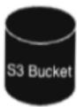
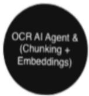
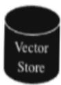
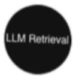

## Project 26

Client Email: Champake.Mendis@tripleasuper.com.au 

Client Name: Champ Mendis 

Client: Triple A Super Pty Ltd 

Title: RAG-Based Chatbot for Advisors 

## Description:

RAG (Retrieval-Augmented Generation) chatbot to answer advisor questions 

Uses documents stored in S3

Provides compliant, consistent, explainable answers 

## Requirements:

## Objectives 

Provide advisors with instant access to policies, procedures, guidelines Provide advisors with the current updates or issues with the documents Reduce human dependency and turnaround time Ensure consistent communication 

Architecture Overview (initial reference)Include RAG pipeline:

1. Document ingestion from S32.Chunking + embeddings 3.Vector store 4. LLM retrieves relevant context 5.Response generated + citations 6. Logs &amp; analytics 

Functional Steps:

1. Advisor asks a question 

2. Query embedded and matched with vector store 

3. Top-K context retrieved 

4. LLM generates response 

5. Output returned with references 

<html><body><table border="1"><tr><td>Project owner:</td></tr><tr><td>Champ Mendis (Champake.Mendis@tripleasuper.com.au)</td></tr><tr><td>Additional Info (if any)</td></tr><tr><td>None</td></tr></table></body></html>

