## Who should complete this annual return?

 Only self-managed superannuation funds (SMSFs) can complete this annual return. All other funds must complete the Fund income tax return 2023 (NAT 71287).

The Self-managed superannuation fund annual return instructions 2023 (NAT 71606) (the instructions) can  assist you to complete this annual return.

The SMSF annual return cannot be used to notify us of a change in fund membership. You must update fund details via ABR.gov.au or complete the Change of details for superannuation entities form (NAT 3036).

## To complete this annual return 

Print clearly, using a BLACK pen only.

 Use BLOCK LETTERS and print one character per box.

<html><body><table border="1"><tr><td>8</td><td>M</td><td></td><td>T</td><td>H</td><td></td><td>8</td><td>T</td><td></td><td></td><td></td><td></td></tr></table></body></html>

 Place x in ALL applicable boxes..

## Section A: Fund information 

## 1 Tax file number (TFN)

 To assist processing, write the fund's TFN at the top of pages 3, 5, 7, 9 and 11.

 The ATO is authorised by law to request your TFN. You are not obliged to quote your TFN but not quoting it could increase the chance of delay or error in processing your annual return. See the Privacy note in the Declaration.

## 2 Name of self-managed superannuation fund (SMsF)

3 Australian business number (ABN) (if applicable)78615715217

## 4 Current postal address 

## 5 Annual return status 

Is this an amendment to the SMSF's 2023 return?

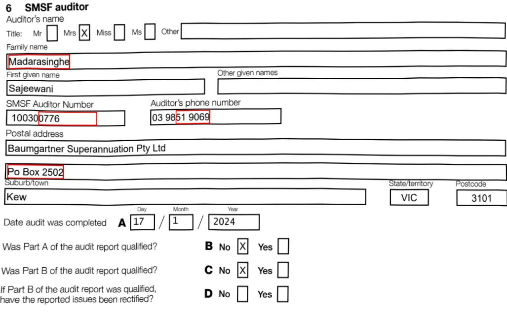

We need your self-managed super fund's financial institution details to pay any super payments and tax refunds owing to you.

## 7 Electronic funds transfer (EFT)

## A Fund's financial institution account details 

This account is used for super contributions and rollovers. Do not provide a tax agent account here.

I would like my tax refunds made to this account. Go to C.

## B Financial institution account details for tax refunds 

This account is used for tax refunds. You can provide a tax agent account here.

## c Electronic service address alias 

 Provide the electronic service address alias (ESA) issued by your SMSF messaging provider.(For example, SMSFdataESAAlias). See instructions for more information.

BGLSF360

## 10 Exempt current pension income 

Did the fund pay retirement phase superannuation income stream benefits to one or more members in the income year?

To claim a tax exemption for current pension income, you must pay at least the minimum benefit payment under the law..Record exempt current pension income at Label A.

No Go to Section B: Income.

Did the fund have any other income that was assessable?.

E Yes  Go to Section B: Income.

No Choosing 'No' means that you do not have any assessable income, including no-TFN quoted contributions..Go to Section C: Deductions and non-deductible expenses. (Do not complete Section B: Income.)

 If you are entitled to claim any tax offsets, you can list.these at Section D: Income tax calculation statement.

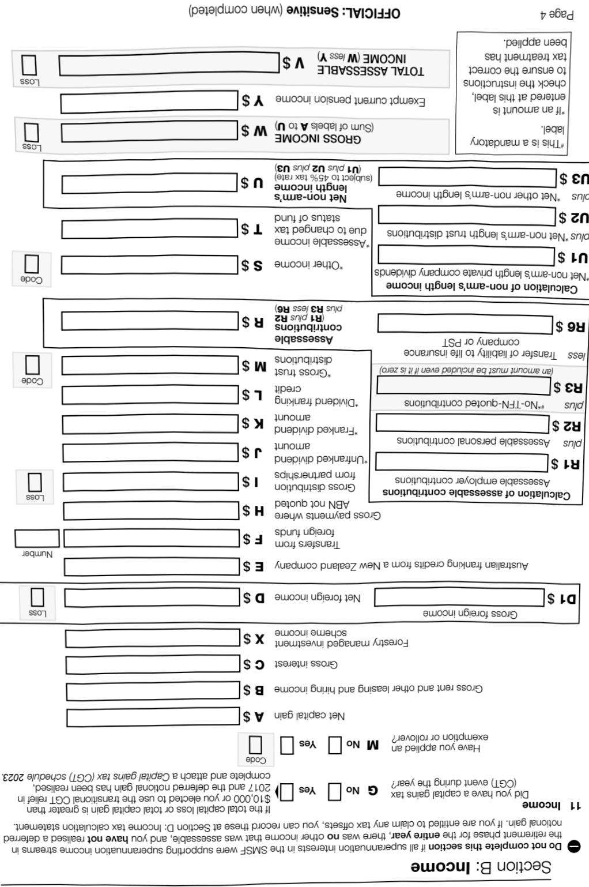

## J0R00CO0O100n01O11 

expenses', list all other expenses or normally allowable deductions that you cannot claim as a deduction (for example, all expenses related to exempt current pension income should be recorded in the 'Non-deductible expenses' column).

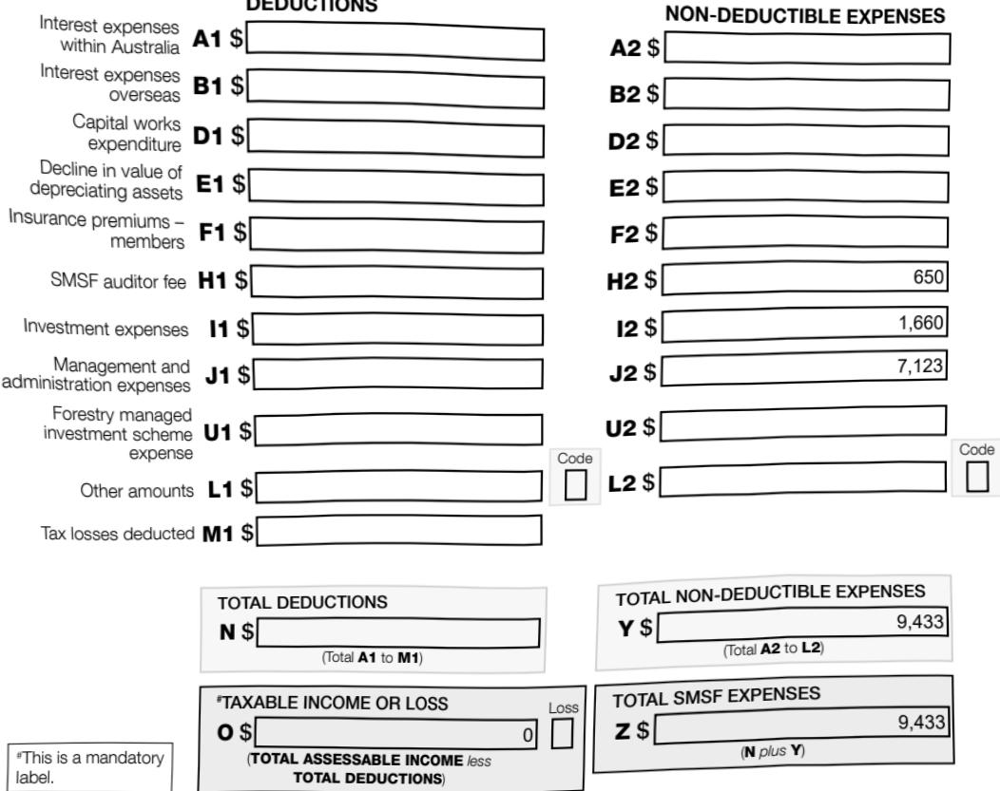

## Section D: Income tax calculation statement 

Section B label R3, Section C label O and Section D labels A,T1, J, T5 and I are mandatory. If you leave these labels blank, you will have specified a zero amount..

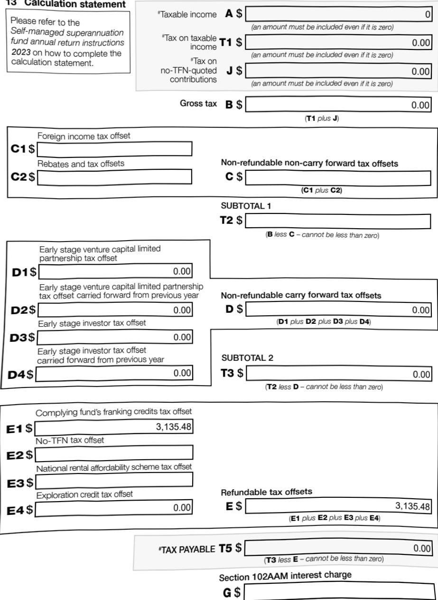

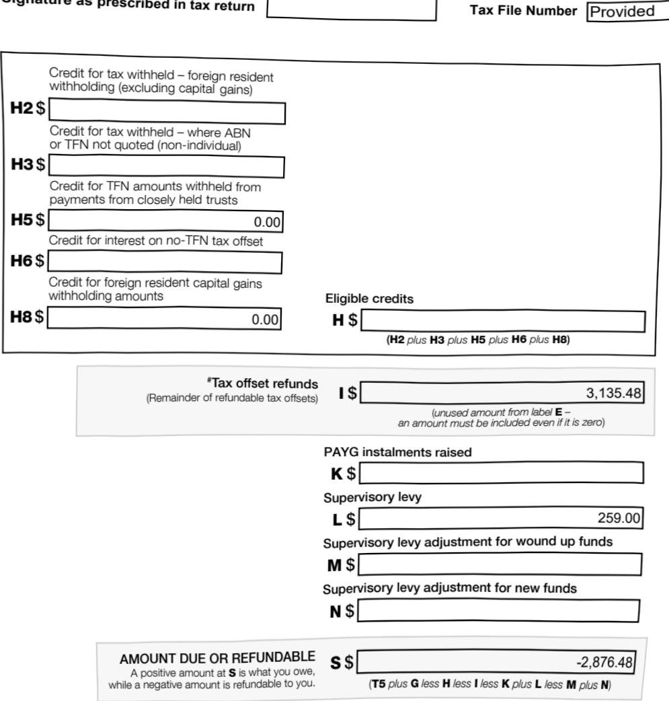

 If total loss is greater than $100,000,complete and attach a Losses schedule 2023.

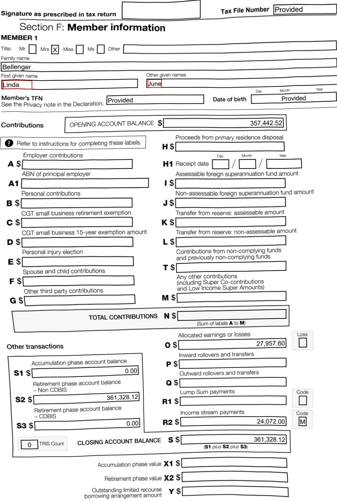

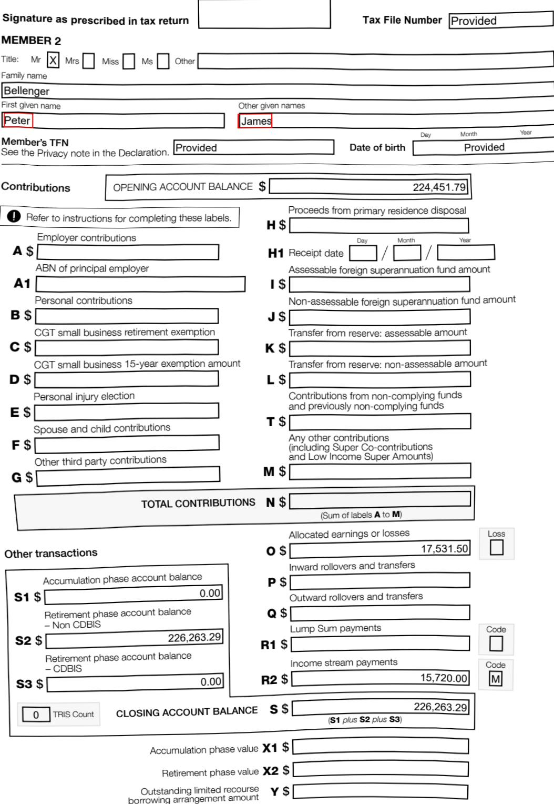

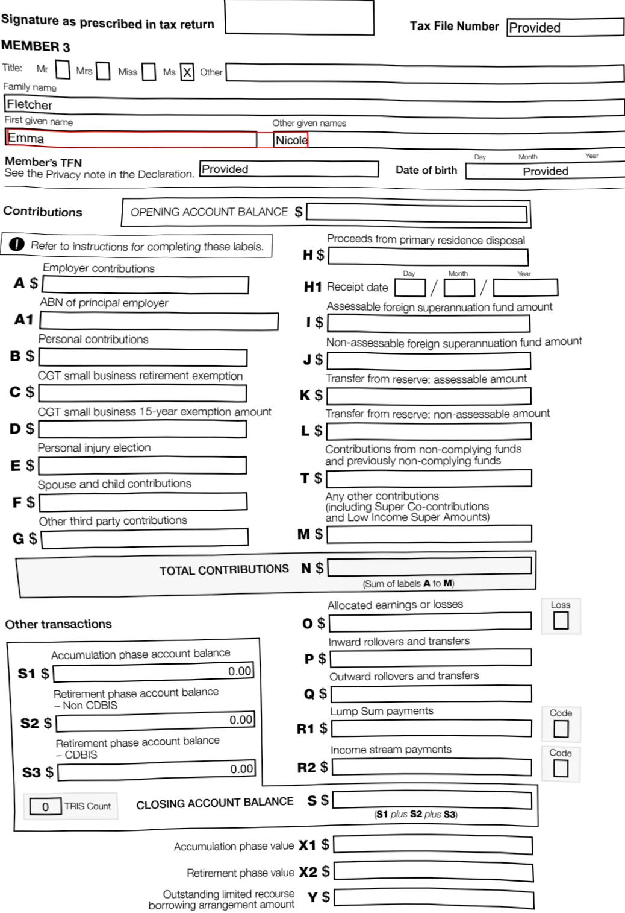

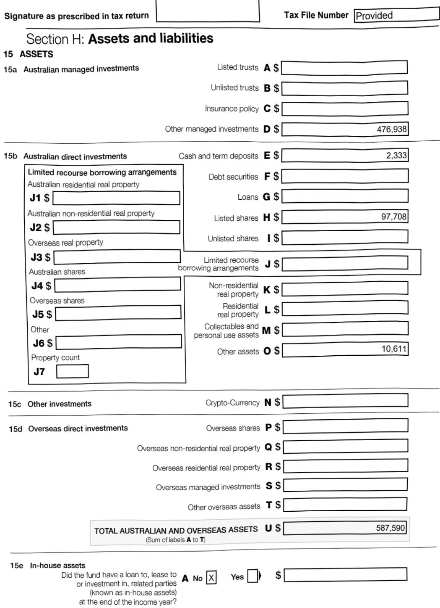

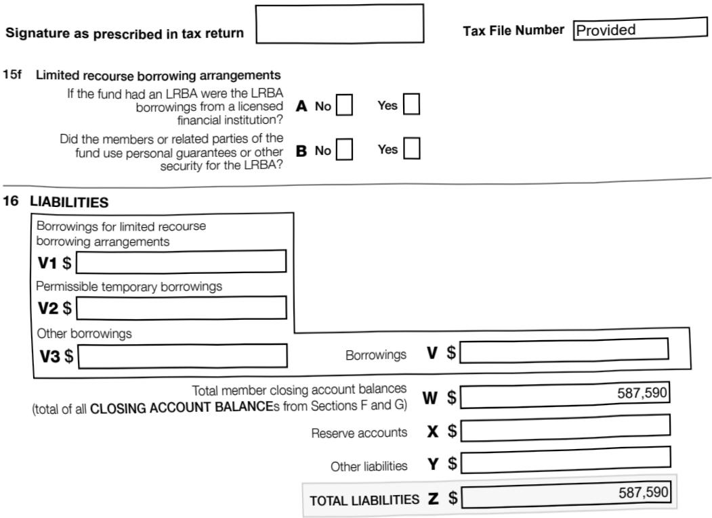

## Section J: Other information

## Section K:Declarations 

Penalties may be imposed for false or misleading information in addition to penalties relating to any tax shortfalls.

## Important 

Before making this  declaration check to ensure that all income has been disclosed and the annual return, all attached schedules and any additional documents are true and correct inevery detail.f you leave labels blankyou wil have specified azero amount or the label was not applicable to you.lf you are in doubt about any aspect of the annual returnplace al the facts before the ATO.

Privacy 

The ATO is authorised by the Taxation Administration Act 1953 to request the provision of tax file numbers (TFNs).We will use the TFN to identify the entity in our records.It is not an offence not to provide the TFN.However if you do not provide the TFN, the processing of this form.may.be.delaved.

TO0I500010OO 

go to ato.gov.au/privacy 

## SHORTTSOHDRECOODSOLADHIION

Ideclare thatthe current trustees and dirctors have authorised this annual return and it is documentd as such in theSMSF'records.Ihave received a copy of the audit report and are aware of any matters raised therein.The information on this annual return, including any attached schedules and additional documentation is true and correct.SOOD 

Authorised txustee's.director's or public officer's signature 

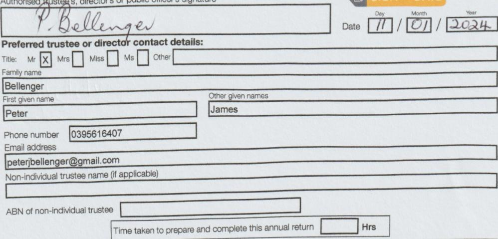

The Commissioner of Taxation as Registrar of the Australian Business Register, may use the ABN and business details which you provide on this annual return to maintain the integrity of the register.For further information, refer to the instructions.

## TDAXAGENTSDEGLARAIION 

 decare that the Self-managed superannuation fund annual retum 2023 has been prepared in accordance with information provided by the trustees,that the trustees have given me a declaration stating that the information provided to me is true and correct, and that the trustees have authorised me to lodge this annual return.

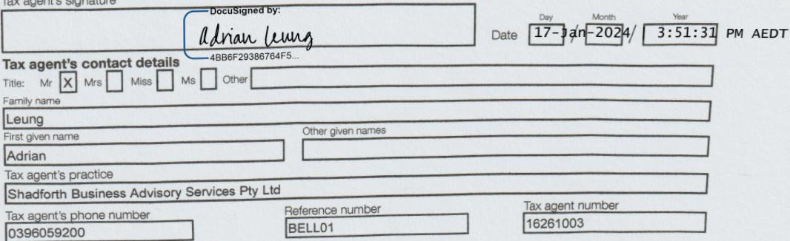

## Capital gains tax (CGT) schedule 

## When completing this form 

 Print clearly, using a black or dark blue pen only.

 Do not use correction fluid or covering stickers.

 Sign next to any corrections with your full signature (not initials)..

 Use in conjunction with company, trust, fund income tax return or the self-managed superannuation fund annual return.

Refer to the Guide to capital gains tax 2023available on our website at ato.gov.au for instructions on how to complete this schedule..! We are authorised by law to request your TFN. You do not have to quote your TFN.However, if you don't it could increase the chance of delay or error in processing your form.

Bell Family Superannuation Fund 

## 1 Current year capital gains and capital losses 

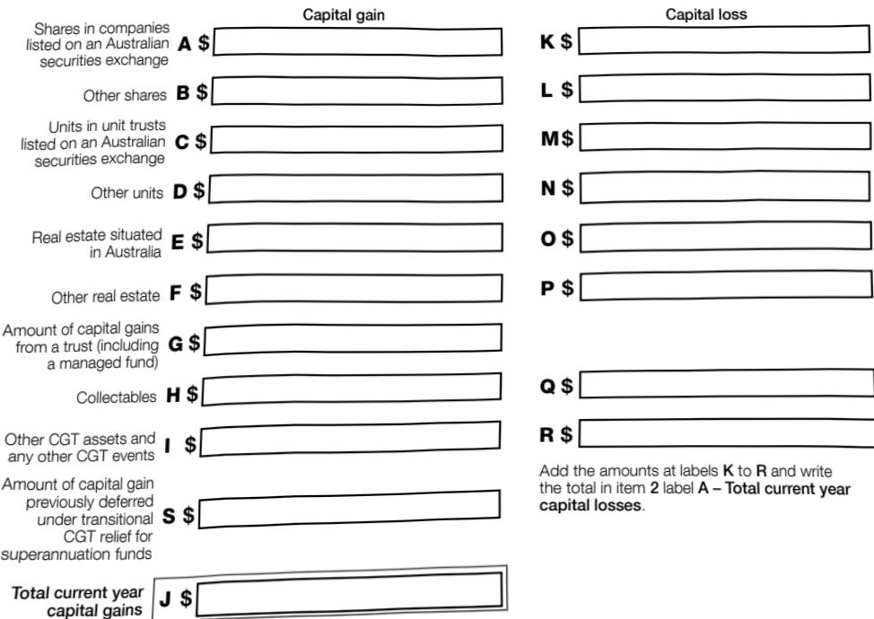

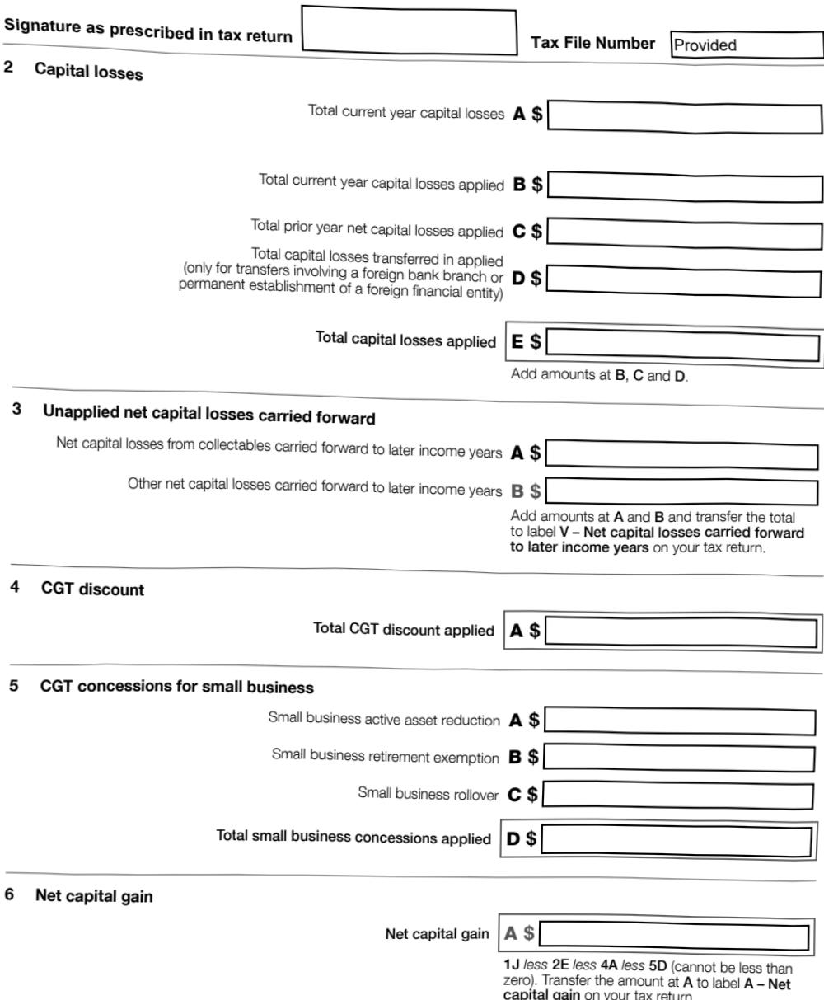

# 8Other CGT information required (if applicable)

## Taxpayer's declaration 

0 If the schedule is not lodged with the income tax retum you are required to sign and date the schedule.

## Important 

Before making this declaration check to ensure that al the information required has been provided an this form and any attachments to this form, and that the information providec is true and correct n &Vey detail. f you are n doubt about any aspect of the tax retum, place all the facts before the ATO. The income tax law imposes heavy penalties for false or misleading statements.

## Privacy 

 information of the person authorisec to sign the dedaration. For information about your privacy go to ato.gov.au/privacy 

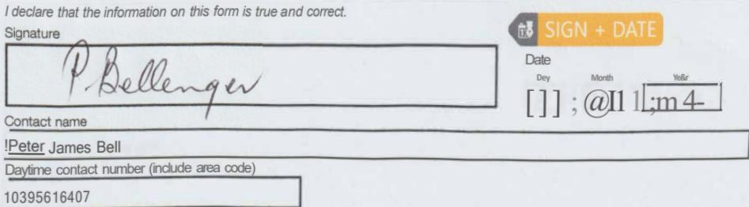

## Losses schedule 

 Refer to Losses schedule instructions 2023, available on our website ato.gov.au for instructions on how to complete this schedule.

Transfer the amount at V to the Net capital losses carried forward to later income years label on your tax return.

Complete item 3 of Part B if a loss is being carried forward to later income years and the business continuity test has to be satis ied in relation to that loss.Stsdnratootatoss 

Do not complete items 1 or 2 of Part B if, in the 2022-23 income year, no loss has been claimed as a deduction, applied  against a net capital gain or, in the case of companies, losses have not been transferred in or out.

### 1 Whether continuity of majority.ownership test passed 

Note: If the entity has deducted, applied,transferred in or transferred out (as applicable)in the 2022-23 income year a loss incurred in any of the listed years, print X in the Yes or No box to indicate whether the entity has satisfied the continuity of majority ownership test in respect of that loss.

2 Amount of losses deducted/applied for which the continuity of majority ownership test is not passed but the business continuity test is satisfied - excludes film losses.

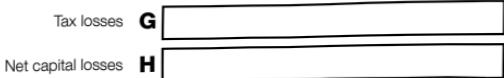

3 Losses carried forward for which the business continuity test must be satisfied before they can be deducted/applied in later years - excludes film losses 

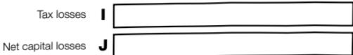

## DOC04ILYCOIO30PIOTIOIOIIO0PPD

 Is the company required to calculate its taxable income or tax loss for  the year under Subdivision 165-B or its net capital gain or net capital loss for the year under Subdivision 165-CB of the Income Tax Assessment Act 1997 (ITAA 1997

## Part C -- Unrealised losses- company only

Has a changeover time occurred in relation to the company after 1.00pm by legal time in the Australian Capital Territory on 11 November 1999?

If you printed X in the No box at L, do not complete M, N or O.

At the changeover time did the company satisfy the maximum net asset value test under section 152-15 of ITAA 1997?

If you printed X in the No box at M, has the company determined it had an unrealised net loss at the changeover time?.

If you printed X in the Yes box at N, what was the amount of.unrealised net loss calculated under section 165-115E of ITAA 1997?

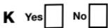

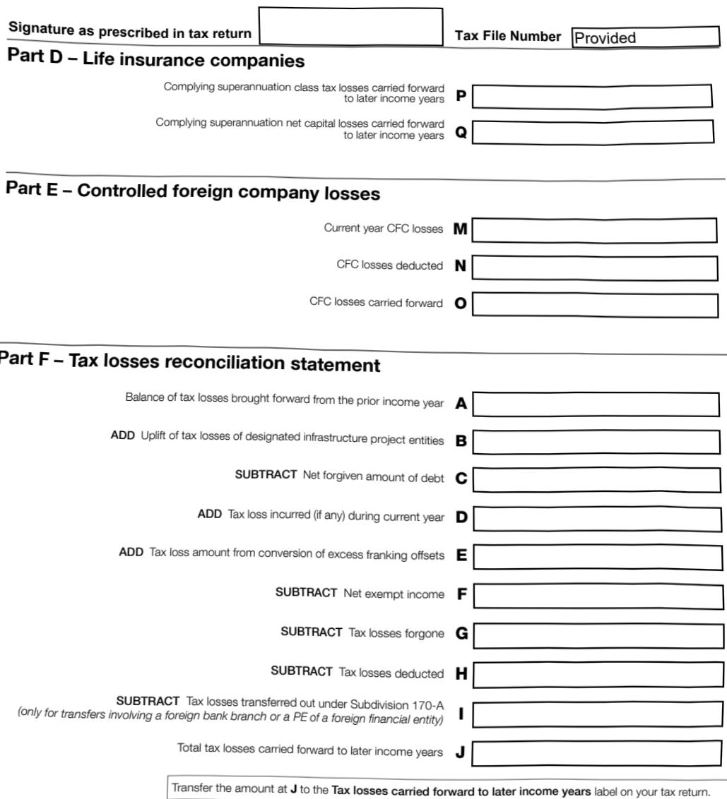

If the schedule is not lodged with the income tax retum you are required to sign and date the schedule.

 Before making this declaration check to ensure that al the information required has been provided on this form and any atachments Important 

to this form, and that the information provided is true and correct in every detail. f you are n doubt about any aspect of the tax retun,

 place al the facts before the ATO. The income tax law imposes heavy penalties for false or misleading statements.

Taxation law authorises the ATO to collect information and disclose it to other govenment agencies. This includes personal Privacy 

 information of the person authorised to sign the declaration. For information about your privacy go to ato.gov.au/privacy 

## Taxpayer's declaration 

I declare that the information on this form is true and correct.