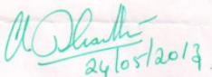
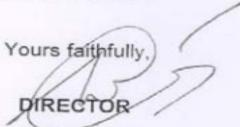

# ANNAUNIVERSITY,CHENNAI  FACULTYOFSCIENCEAND HUMANITIES  CHENNAI -600 025.INDIA 

Prof.K. SHANTHI, Ph.D Chairperson 

Sample Scanned Copy:

Academic Year : 2012-2013

Phone:+91-44-22358488+91-44-22358654Cell:+91-9840146642+91-9962520678shanthiramesh@annauniv.edu 

24.05.2013

# To whom so ever it may concern 

This is to certify that Dr. O.D.Shakila. Associate Professor of Chemistry, K.L.N. College of Engineering, Pottapalayam- 6011 has attendedtheAnnaUniversity-18tmeetingof Boardof Studiesat Anna University on 24.05.2013.

(Chairman, Faculty of S&H)

ANNAUNIVERSITY,CHENNAI FACULTYOFSCIENCEANDHUMANITIES CHENNAI-600025.INDIA 

Prof.K.SHANTHI,Ph.D.nerso 

Phone：+91-44-22358488+91-44-22358654Cell ：+91-9840146642+91-9962520678shanthiramesh@annauniv.edu 

29.10.2013

# To whom so ever it may concern 

This is to certify that Dr.J.K.SUBASHINI, Professor & Head,Department of Mathematics, K.L.N.College of Engineering, Pottapalayam630611 has attended the Anna University-Syllabus Sub Committee meeting held in the Department of Mathematics,Anna University on 29.10.2013.

(Chairman,Faculty of S&H)

Off:22516020.6306

E-Mail:chairmanice@gmail.com 

FACULTYOFINFORMATIONANDCOMMUNICATION 

ENGINEERING 

ANNA UNIVERSITY 

CHENNAI-600025

Dr.V.VAIDEHI 

Chairperson 

18.08.2014

To 

Dr.N. Balaji 

Professor & Head Information Technology,KLN College of Engineering,Pottapalayam, Sivagangai Dist Madurai-630 611.

Sir/Madam,

Sub:Anna University-Syllabus Sub Committee Meeting of the Faculty of Information and 

Communication Engineering - Reg.

Ref:Vice-Chancellor's approval dated :08.06.2012

## ********

It is proposed to conduct the Syllabus Sub Committee Meeting of CSE and IT ofthe FacultyofInormationandCommunicationEngineeringtodiscussthefollowingiems 

1.Additionof anelective on"FoundationSkills in Integrated Product D Development (FSIPD).

2.Addition of books in references.

Date and Time :27.08.2014 (Wednesday) at10.00.a.m.Venue :Academic Council Hall Anna University,Chennai-25

Irequest you to kindly make it convenient to attend the meeting and offer your valuable contributions.Alineof confirmationregardingyour participation through Phone/E-mail:will be greatlyappreciated.

With kind regards,

EADAOANWDERSPAACIPANGNTHEMEENG 

Traveling Allowances.a 

MemberromChCitilbeadteeofaandsvllg allowance.

Ta2o(bourvvuyo/bywsrOuosfanrarearuSnmgFeeofR5.1ooo/-DerdaV.Members from outside Chennai city will be paid Traveling Allowance at the rate of 

MembersromoutsidtheTamiNadutateareliibleorAirareconomyClassohways besides Rs.10o-towards conveyance charges (to andfro Residence-Airport-University) and sitting fee Rs.10o/-per day for attending the meeting.

Travel by carispermitteduptoamaximumof2okmsboth ways and will bepaid Rs.7/perkm subjecttothroductionofofilbillromtheTravlAecwtTRistrationnumber).

# ANNAUNIVERSITY  CHENNAI-600025.INDIA 

REGISTRAR 

Phone:+91-44-22352161+91-44-22357003Fax +91-44-22351956Gram:ANNATECH E-mail:registrar@annauniv.edu 

#### Procs.No.666/AUC/CAC/2016

## To 

Dr.Jothimurugan T 7Director,Department of MBA KLN college of Engineering Pottapalayam,sivagangai district -630 612.

## Sir / Madam,

Dated:11.02.2016

Sub: Anna University,Chennai– Affiliated Institutions– Boardof Studiesof the –Information—Reg.Faculty of Management Sciences — Constitution — Appointment of members Ref:Vice-Chancellor's approval dated 28.09.2015.

I am pleased to inform you that the Vice –Chancellor has appointed you as a Member of the Board of Studies of the Affiliated Institutions under the Faculty of Management Sciences of Anna University,Chennai.

A copy of the Syndicate Resolution indicating the powers and functions of the Board is also enclosed for your reference.

The Membership is honorary and it is for a tenure of three years upto February 2019.

Iam to request you to kindly accept the offer and send your acceptance letter onor before 04.03.2016.either by post or by-E-mail (dac@annauniv.edu).

With kind regards,

Encl: As above 

FATIMACOLLEGE (AutonOmOuS)(CollegewithPotential forExcellence)

UGDepartment of Computer Applications 

Mary Land, Madurai-18.PHONE:2668016,2669015.FAX:0452-2668437

Date:31.03.2017.

to 

Dr. N. Balaji,

Professor & Head,

Dept. of Information Technology,

KLN College of Engineering,

Pottapalayam.

Sivagangai.

Dear Sir,

We are pleased to inform that you have been appointed as the Subject Expert in our Board of Studies for the course B.C.A.With regard to this we have planned to convene the meeting on 5tApril,2017at10.00 a.m.in the DepartmentofComputer Applications(BCA).

Looking forward for your favorable reply.

Thanking You,

Yours truly,(P.Nancy Vincentina Mary)Head of the Department 

Dr.Sr.K.Fatima Mary, M.A.,Ph.D.,D.Litt,HDSE.PGDVE Principal 

### No.25/P/2016-2017

Dr.N.Balaji 

Professor & Head 

Department of IT 

KLNCollegeof Engineering 

Pottapalayam 

Sivagangai Dist.

## Sir/Madam,

FATIMACOLLEGE (AutOnOmOuS)Re-Accredited with'A'Grade by NAAC)(College withPotential for Excellence)Mary Land, Madurai-18.

PHONE:2668016,2669015FAX ：0452-2668437Email ：fatimacollegemdu@gmail.com Date ：28.03.2017

Sub:Fatima College (Autonomous), Madurai-Board of Studies Meeting-Reg.

## ** **

Department of M.C.A.is happy to have you as the Board member and we are sure that your interactions and contributions would help us to sustain and enhance the quality of education given in Fatima College.

The meeting of the Board of Studies in M.C.A.will be heldon 04.04.2017 at 3.00 P.M.Please make it convenient to be present for the meeting.

Thank you.

Yours sincerely,

(Dr. Sr. K.Fatima Mary)PRINCIPAL FATIMACOLLEGE(AUTONOMOUS)

MADURA1-625018

Off:22357077/76Fax/Dir:22352272

# CENTREFORACADEMICCOURSES  ANNA UNIVERSITY  CHENNAI-600025

##### Dr.T.V.GEETHA DIRECTOR 

Lr.NO.4440/AU/SSC/CBCS/FICF/2016

To 14

Dr. N. Balaji 

Head,DEPTOFIT 

KLN College of Engineering 

Pottapalayam 

Sivagangai District-630612

Sir/Madam,

14.10.2016

Sub: Anna University - Syllabus Sub Committee - Revision of Curriculum and Syllabi under R-2017 for the Constituent Colleges and Affiliated InstitutionsFaculty of Information and Communication Engineering - Appointment as Member-Information-Reg.

I have the pleasure of informing you that the Registrar, Anna University has appoited you as a Member of the Syllabus Sub Committee for framing the Curricula and Syllabi for B.E. Computer Science and Engineering, B.Tech. Information Technology, and B.E.Computer and Communication Engineering,to be offered in UG degree Programmes under R-2017 by the Constituent Colleges and Affiliated Institutions of Anna University,Chennai under the Faculty of Information and Communication Engineering in accordance with the Choice Based Credit System (CBCS).

Iam to inform you that the Syllabus Sub Committee Meeting of the Faculty of Information and Communication Engineering will be held on 01.11.2016 (Tuesday)at 10.0O AM at Turing Hall, Department of Computer Science and Engineering,CEG Campus, Anna University, Chennai.

The Agenda will be:

Full Curriculum of UG Programmes and Syllabi ofI&ll Semesters.

Salient points of the general guidelines as per AICTE norms is enclosed. The AICTE guidelines are available atwww.aicte-india.org/modelsyllabus.php-for reference.

Please come prepared with your inputs, so that we can prepare quality Curriculum &Syllabi. The main discussions will be held on the day of the Syllabus Sub Committee meeting.However,the finalization will be through interaction-using group e-mails.

Thank you in advance for your co-operation.

I am to request you to kindly accept the offer and send your acceptance letter on or before 21.10.2016,either by post or by E-mail (ICE.SSC8@gmail.com).

