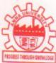
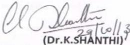
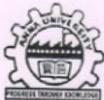

Prof.K.SHANTHI.Ph.D.Chairperson 

Phone:+91-44-22358488+91-44-22358654Cell+91-9840146642+91-9962520678shanthiramesh@annauniv.edu 

24.05.2013

This is to certify that Dr. O.D.Shakila. Associate Professor of Chemistry, K.L.N. College of Engineering, Pottapalayam- 630611 has attended the Anna University-18th meeting of Board of Studies at Anna University on 24.05.2013.

(Chairman, Faculty of S&H 

Phone+91-44-22358488+91-44-22358654Cell +91-9840146642+91-9962520678shanthiramesh@annauniv.edu 

29.10.2013

This is to certify that Dr.J.K.suBAsHINI, Professor &Head,Department of Mathematics, K.L.N. College of Engineering, Pottapalayam630611 has attended the Anna University-Syllabus Sub Committee meeting held in the Department of Mathematics,Anna University on 29.10.2013.

Chairman,Faculty ofs&H)

Dr.N.Balaji 

Professor & Head Information Technology,KLN College of Engineering Pottapalayam,Sivagangai Dist Madurai-630 611.

Sub:Anna University-Syllabus Sub Committee Meeting of the Faculty of Information and 

Communication Engineering -Reg.

Ref: Vice-Chancellor's approval dated:08.06.2012

It is proposed to conduct the Syllabus Sub Committee Meeting of CSE and IT of the Faculty of Information and Communication Engineering to discuss the folowing items.

Development (FSIPD).

2.Addition of books in references.

I request you to kindly make it convenient to attend the meeting and offer your valuable contributions.A line of confirmation regarding your participation through Phone /E-mail will be greatly appreciated.

With kind regards,

1oyAowdn Traveling Allowances.

Members from Chennai City will be paid sitting fee of Rs.1000/-per day and Rs.400/-as travelling allowance.

STo z/otboerbeyobyymotoiuss ranrrareandsnngFeeofRs1ooo-perday.Members from outside Chennail city will be paid Traveling Allowance at the rate oi 

Members from outside the Tamil Nadu State are eligible for Airfare (Economy Class) on both ways besides Rs.1200/-towards conveyance charges (to and fro Residence-Airport-University) and 0g19911e18e0p979016701e1790100g sitting fee Rs. 1000/- per day for attending the meeting.

Travel by car is permitted upto a maximum of 200kms both ways and will be paid Rs.7/per km subject to the production of official bil from the Travel Agency (with TIN Registration number.

REGISTRAR 

#### Procs.No.666/AUC/CAC/2016

Dr.Jothimurugan T 7Director,Department of MBA KLN college of Engineering Pottapalayam,sivagangai district-630 612.

Phone +91-44-22352161+91-44-22357003Fax _s 91-44-22351956GramANNATECH E-mail :registrar@annauniv.edu 

Dated:11.02.2016

Sub: Anna University Chennai-Affiliated Institutions -Board of Studies of the Information-Reg.Faculty of Management Sciences-Constitution-Appointment of members Ref:Vice-Chancellors approval dated 28.09.2015.

I am pleased to inform you that the Vice Chancellor has appointed you as a Member of the Board of Studies of the Affiliated Institutions under the Faculty of Management Sciences of Anna University.Chennai.

A copy of the Syndicate Resolution indicating the powers and functions of the Board is also enclosed for your reference.

The Membership is honorary and it is for a tenure of three years upto February 2019.

I am to reguest you to kindly accept the offer and send your acceptance letter on or before 04.03.2016.either by post or-by-E-mail (dac@annauniv.edu)

With kind regards,

Encl:As above 

FATIMA COLLEGE (Autonomous)(College with Potential for Excellence)

UG Department of Computer Applications 

Mary Land,Madurai-18.PHONE:2668016,2669015.FAX:0452-2668437

Date:31.03.2017.

Dr.N.Balaji,

Professor & Head,

Dept.of Information Technology,

KLN College of Engineering,

Pottapalayam,

Sivagangai.

Dear Sir,

We are pleased to inform that you have been appointed as the Subject Expert in our Board of Studies for the course B.C.A. With regard to this we have planned to convene the meeting on 5h April, 2017 at 10.00 a.m.in the Department of Computer Applications(BCA).

Thanking You,

Yours truly,P.Nancy Vincentina Mary)Head of the Department 

Dr.Sr.K.Fatima MaryM.A.Ph.D.D.Litt. HDSE.PGDVE Principal 

Dr.N.Balaji 

Professor & Head 

Department of IT 

KLN College of Engineering 

Pottapalayam 

Sivagangai Dist.

FATIMA COLLEGE (Autonomous)Re-Accredited withA'Grade by NAAC)(College with Potential for Excellence)Mary Land, Madurai-18.

PHONE:2668016,2669015FAX 0452-2668437Email fatimacollegemdu@gmail.com Date 28.03.2017

Sub:Fatima College (Autonomous),Madurai-Board of Studies Meeting-Reg.

Department of M.C.A.is happy to have you as the Board member and we are sure that your interactions and contributions would help us to sustain and enhance the quality of education given in Fatima College.

The meeting of the Board of Studies in M.C.A. will be held on 04.04.2017 at 3.00 P.M.Please make it convenient to be present for the meeting.

Thank you.

##### Dr.T.V.GEETHA DIRECTOR 

TO 14

Dr.N.Balaji 

Head,DEPT OF IT 

KLN College of Engineering 

Pottapalayam 

Sivagangai District-630 612

14.10.2016

Sub: Anna University - Syllabus Sub Committee - Revision of Curriculum and Syllabi under R-2017 for the Constituent Colleges and Affiliated Institutions Faculty of Information and Communication Engineering - Appointment as Member-Information-Reg.

I have the pleasure of informing you that the Registrar,Anna University has appointed you as a Member of the Syllabus Sub Committee for framing the Curricula and Syllabi for B.E. Computer Science and Engincering, B.Tech. Information Technology, and B.E. Computer and Communication Engineering, to be offered in UG degree Programmes under R-2017 by the Constituent Colleges and Affiliated Institutions of Anna University,Chennai under the Faculty of Information and Communication Engineering in accordance with the Choice Based Credit System (CBCS).

I am to inform you that the Syllabus Sub Committee Meeting of the Faculty of Information and Communication Engineering will be held on 01.11.2016 (Tuesday) at 10.00 AM at Turing Hall, Department of Computer Science and Engineering,CEG Campus,Anna University.Chennai.

>Full Curriculum of UG Programmes and Syllabi of I &ll Semesters.

Salient points of the general guidelines as per AlcTE norms is enclosed. The AlCTE guidelines are available at www.aicte-india.org/modelsyllabus.php-for reference.

Please come prepared with your inputs, so that we can prepare quality Curriculum &Syllabi. The main discussions will be held on the day of the Syllabus Sub Committee meeting.However,the finalization will be through interaction-using group e-mails.

Thank you in advance for your co-operation.

I am to request you to kindly accept the offer and send your acceptance letter on or before 21.10.2016.either by p0st or by E-mail (ICE.SSC8@gmail.com.

