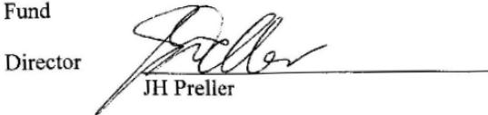
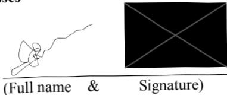

# Trust Deed for a Self Managed Superannuation Fund 

Trust document issued by:.

Superannuation Warehouse Australia Pty Ltd.

3 \ 480 Collins Street, Melbourne, VIC, 3000ABN 62 141 409 449

Tel 03 86106999

Fax 03 8610 6334

Mobile 0411241215

admin@superannuationwarehouse.com.au www.superannuationwarehouse.com.au 

Establishing the 

Summers Family Super Fund (the Fund')

## INTRODUCTION 

This superannuation Trust Deed is written in plain language. This Trust Deed is in accordance with guidelines issued by the Australian Taxation Office, responsible for regulating Self Managed Superannuation Funds.

In this document:

 The singular of any term shall include the plural thereof and the plural of any term shall include the singular.

Each gender shall include each of the other genders..

"SISA"' means the Superannuation Industry (Supervision) Act 1993.

"ATO Guidelines' means Running a Self-Managed Super Fund and other updates or relevant guidelines issued by the ATO from time to time.

## MEMBERS AND TRUSTEES 

The Members and Trustees of the Fund are as follows:

1. John Summers 2.Sandra Summers ("Member/s")

1. John Summers 2. Sandra Summers (Trustees")

## FUND - Establishment and Purpose:

1. This Trust Deed is made between the Fund Member/s and the Fund Trustees (as amended in writing from time to time).

2. The Fund Member/s and the Fund Trustees hereby elect to establish and maintain a superannuation fund with the sole purpose of providing retirement benefits to.the Fund Member/s.

3. The Trustees have agreed that the Fund will be a regulated fund and that it will be conducted in line with the ATO Guidelines. In particular, the Fund will be operated and managed in accordance with the requirements of SISA, to ensure it qualifies for the concessional tax rates applicable to "Complying Superannuation Funds."

4. The Trustees have agreed to act on behalf of the Fund Member/s, and in the interest of the Fund. In particular, the Trustees agree:

a. to act honestly in all matters concerning the Fund;

b. to exercise skill and diligence in managing the Fund;

c. to act in the best interest of all Fund Members,

d. to keep the money and assets of the Fund separate from other money and.assets (for example, the personal assets of Trustees);

e. to retain control over the Fund;

f. to develop and implement an investment strategy for the Fund;

g. not to enter into contracts or behave in a way that hinders Trustees from.performing or exercising their functions or powers;

h. to allow Fund Members access to certain information regarding the Fund;

i. not to access or allow others to access funds, except as provided for in this Deed; and 

j.to ensure that the Fund is operated in a way consistent with all relevant.legislation, in order to comply with the requirements of a "Complying.Superannuation Fund" under the SISA..

## FUND - Objectives:

5. The objective and sole purpose of the Fund is to provide retirement benefits to the Fund Member/s.

6. The Fund will only undertake investment activities with the contributions of Fund Members which are prudent, and consistent with the intention of providing retirement benefits to Fund Members..

7. In particular, the Fund is not permitted to engage in investment strategies or.products that:

a. are speculative in nature;

b. would not be utilised by similar Funds; and.

c. would not be reasonably likely to produce stable, consistent, regular.returns on equity.

8. To this end, the investment of Members contributions will be conducted in accordance with the Investment Strategy..

## MEMBER/S - Membership; Definitions and Meetings 

### 9. Fund Membership:

The Membership of the Fund Consists of the Member and Trustees of the.Fund (as amended from time to time).

b. Any such amendment will be affected by a written variation to this Deed..

### 10. Membership Criteria:

a.Each Member must be a Trustee, or a Director of the Corporate Trustee.

b.Membership will cease when:.

i. payment of the Member's benefits are made to the Member or to a benefit arrangement on behalf of the Member; or.

ii. the Member dies; or 

iii. the Member ceases to be a Trustee of the Fund;.

iv. the remaining Trustees determine on a reasonable basis that the Member should cease to be a member..

c. New Members can be added to this Trust by that person signing an addendum to this Deed, or an amendment the Deed.

d. All existing Trustees need to agree in writing to the appointment or removal of any Trustee/s.

### 11. Membership Compliance:

a.  A Member must immediately inform the Trustees when:

i. The Member enters into an employment arrangement with another Member of the Fund who is not a relative; or.

ii. The Member is disqualified for any reason from being a Trustee of the Fund or Director of the Corporate Trustee of the Fund.

b. In the event of either 11(a) above, membership must cease as soon as is practical.

### 12. Member Contributions:

a. Contributions can be made as lump sum payments, or regular contributions.

b. Members can only contribute the types of assets authorised by this Trust Deed (as detailed under "Investments" below).

c.  Contributions can be from the Member, the Member's employer or Member's government co-contribution, and can be concessional or nonconcessional.

d. The Fund can also receive transfers on from a Member's existing superannuation fund.

### 13. Member Benefit Accounts:

a. Each Member must have a separately identifiable accumulation account or pension account.

b. The administrative and other costs of running the Fund will be split equally between the Members of the Fund, calculated pro rata to their total assets in the Fund, as at the year end (being 30th June each year). In the event that any Member joins or leaves the Fund during the financial year,that Member will pay a pro rata share of administrative costs.

c. Tax will be calculated on behalf of each Member and applied directly to the Member account balance.

d. The Trustee may set out an equalisation amount to allow for a Reserving Strategy or to accrue for Expenses or Tax.

e. A Contribution Reserve Account may be created at the discretion of the Trustees.

### 14. Member Investments 

Authorised investments of the Fund are set out in the Investment Strategy and include the following:

a. Shares and related investments including options, futures and CFD's;

b.  Separately Managed Accounts, Managed Investments and Unit Trusts;

c.Foreign exchange, gold and silver;

d. Bank operating accounts, cash, bonds, fixed term deposits and term.deposits;

e.Direct property and listed property,

f.Collectibles and Art; and 

g. Other authorised investments.

All contributions are allocated to the Member who actually contributes those assets towards the Fund. All net investment earnings are allocated to members on a pro rata basis. An individual Member account must be kept for each Member. Investment earnings should be allocated to Members on a time-weighted basis.

### 15. How Benefits (Pension or Lump Sum) can be made in compliance with SISA Requirements:

a. When a Member reaches retirement age, and Conditions of Release (as detailed at 17(b)) have been met, Benefits can be paid out to the Member..b. Benefits can be paid out as a lump sum, or as a regular income stream.

### 16. When Benefits can be paid to Members:

a. The preserved benefit held on account for each Member must not be paid.out by the Trustees when prohibited by superannuation law..

b. The preserved benefit can only be paid out to a Member when the.Australian Tax Office (ATO) "Conditions of Release' have been met..These conditions include reaching preservation age, permanent incapacity or on compassionate grounds.

c. Any restricted or unrestricted non-preserved benefit can be paid out when the conditions set under the SISA are satisfied..

d. Members are permitted to pay Life Insurance premiums from their Member balances.

e. Any Tax payable on a Benefit must be deducted before the payment is made to the Member.

### 17. Pension Mode:

a.When conditions to commute to pension are satisfied by a Member and the Member elects to commute to Pension Mode, the Trustees must ensure.that the Member Benefits are locked into the applicable Pension Mode.

b.  Pension payments to the Member will be made in terms of the ATO Guidelines and any other regulations applicable to pension accounts.

## TRUSTEES 

### 18. Trustee Requirements:

a. By signing this Trust Deed, the Trustees accept their appointment to manage the Fund in accordance with the requirements set out in this Trust.Deed.

b. The Trustees must act jointly in the interest and to the benefit of the Fund Member/s only.

c. The Trustees will not receive any payment to carry out their duties as Trustees of the Fund.

d. Any Trustee may call a meeting of all the Trustees by giving at least 5days prior notice to each of the other Trustees. The Trustee will notify the Fund administrator. All Members are responsible for ensuring their contact details are correct.

e.A quorum consists of all the Trustees. If all Trustees are not in attendance within 15 minutes of the scheduled starting time of the meeting, the meeting will be adjourned for 5 days.

f. On the day of the adjourned meeting, a quorum will consist of those Trustees in attendance at the start of the meeting.

g. Decisions at the meeting must be made unanimously. If a unanimous  decision cannot be reached, the decision must be by majority. If a majority.cannot be reached, or in the event that one or more Member's believes that a proposal is outside the scope of this Deed, and/or would not be in the best interests of all Members:

i. That Member/s or Member may notify other Member's of the dispute.

ii.Within 7 days of notifying other Members, that Member will request the administrator to engage a professional, independent arbitrator, as recommended by the Australian Centre for International Commercial Arbitration.

iii.  The Member's agree to appoint that arbitrator, to be funded.

equally by all Members, within 28 days of the Member providing.

notice about that dispute.

iv. The decision of the arbitrator will be final, and binding upon all.Members.

### 19. Trustee Criteria:

a. Each Trustee appointed to this Deed must be an individual or corporate entity eligible to act as a Trustee, in accordance with SISA.

b.The appointment of Trustees must be in writing..

c.A Trustee appointment shall cease if that Trustee:

i. is disqualified from holding office as per SISA regulations,

ii. resigns,

iii. is ill for a prolonged period of time and incapable of adequately performing their role; or 

iv. dies.

### 20. Trustee and Professional Advisors Responsibilities:

a. The Trustees hereby appoint Superannuation Warehouse Australia Pty Ltd.as administrator of the Fund..

b.The administrator will:.

i. Provide accounting and taxation services to the Fund, and.

ii.  Appoint an auditor on behalf of the Fund.

c.All Members are entitled to seek copies of any documents relevant to the.Fund that are maintained by the administrator..

### 21. Variation of the Trust Deed:

a. This Deed may be varied by the Trustees on a prospective or retrospective.basis. This can be done at any time and must be signed by all Trustees..

### 22. Legal Application and Requirements:

a. This deed will be interpreted consistent with a way that ensures the Fund 

complies with SISA, the ATO Guidelines, and any other relevant.

regulations to ensure that it is a Complying Superannuation Fund..

b.  Trustees must at all times adhere to the rules of superannuation law and other laws relevant to this Fund..

c. The Fund must at all times be run in such a way that it qualifies for concessional tax treatment under the Income Tax Assessment Act..

### 23. Fund Winding Up Procedures and Requirements:

a. Trustees are allowed to wind up the Fund when there are no Members.remaining in the Fund, or the Trustee determines for any legal reason that the Fund should be wound up..

b.When the Fund is wound up, each Member will receive notice thereof in writing and Member Benefits will be paid to and for the benefit of any eligible Fund Member only.

### 24. Member Benefits upon Death:

a. The Death Benefit agreement nominations will be as follows:

i.John Summers - 100% to Sandra Summers 

ii.  Sandra Summers - 100% to John Summers 

b. Where there is no valid Death Benefit nomination, the Trustees may pay the Member Balance to dependants or legal personal representatives in any proportions that the Trustee deems appropriate at that time.

c. This Trust Deed provides for the use of Pension Reversionary Benefits upon the death of a member. The Trustees will decide if an income stream (pension) or a lump sum will be paid on the death of the deceased member.

### 25. Administration of the Fund:

The Fund is set up and will be administered by Superannuation Warehouse Australia Pty Ltd. This includes preparation of annual financial statements, fulfilling the duties as tax agent and appointing the auditor.

The practice details are as follows:.

Principal -- Hein Preller Institute of Chartered Accountants in Australia.

Member number 2159543 \ 480 Collins Street, Melbourne, VIC, 3000

## Executed as a Deed 

### 1. Date of Deed and Fund establishment 

Date of Deed 21 January 2012Date of Fund establishment 21 January 2012

### 2. Names and Addresses of Trustees 

Trustee 1

Full name John Summers 

Address 9 Summers Road, Sydney NSw 2000

Signature 

Trustee 2

Full name Sandra Summers 

Address 9 Summers Road, Sydney Nsw 2000

Signature 

### 3. Witnesses 

Witness 1

Witness 2

(Full name &Signature)

