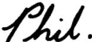

Our Ref. 350/PJC/EAC 

Dr. P.N. Cundall,Mining Surveys Ltd.,Holroyd Road,Reading,Berks.

Dear Pete,

18th January, 1972.

Permit me to introduce you to the facility of facsimile.transmission.

In facsimile a photocell is caused to perform a raster scan over.the subject copy. The variations of print density on the document.cause the photocell to generate an analogous electrical video signal.This signal is used to modulate a carrier, which is transmitted to a remote destination over a radio or cable communications link..

At the remote terminal, demodulation reconstructs the video signal, which is used to modulate the density of print produced by a printing device. This device is scanning in a raster scan synchronised with that at the transmitting terminal. As a result, a facsimile copy of the subject document is produced..

Probably you have uses for this facility in your organisation..

Yours sincerely,

P.J. CROSS 

Group Leader - Facsimile Research 